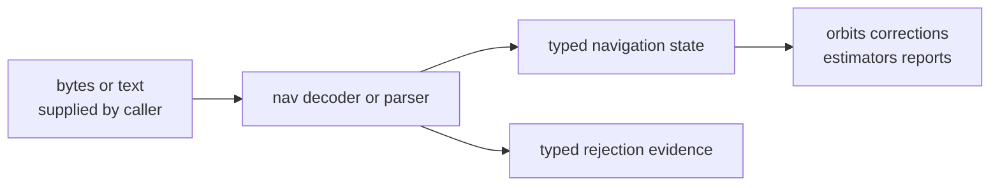

# Format And Product Contracts

Navigation formats are domain encodings, not generic file input. This contract
defines how external navigation messages, RINEX records, and precise products
enter `bijux-gnss-nav` as typed scientific state or typed rejection evidence.

## Product Entry Flow

The contract begins when the caller has already located the product bytes or
text. Repository discovery, dataset registration, cache layout, and command
flags stay outside this page.

## Owned Product Families

| family | source area | produced meaning |
| --- | --- | --- |
| GPS LNAV and CNAV | `src/formats/gps_navigation/` | GPS broadcast navigation records and decode refusals |
| Galileo FNAV and INAV | `src/formats/galileo_navigation/` | Galileo broadcast navigation records and decode refusals |
| BeiDou B1I and D2 | `src/formats/beidou_navigation/` | BeiDou navigation records and constellation-specific timing meaning |
| GLONASS navigation | `src/formats/glonass_navigation/` | GLONASS navigation records and slot-aware state |
| RINEX navigation and observation | `src/formats/rinex_navigation/`, `src/formats/rinex_observation/` | text products converted into typed nav or observation-domain records |
| precise products | `src/formats/precise_products/` | SP3, CLK, ANTEX, and bias SINEX state for downstream nav use |

## Stability Expectations

- Decoded records keep constellation-specific scientific meaning explicit.
- Rejection evidence names the invalid product condition, not just parse
  failure.
- File discovery and repository placement remain infra or command concerns.
- Product parsers do not hide solver policy; estimators decide how to consume
  typed state.
- Adding a product family updates the format docs and the nearest reference
  test in the same change.

## First Proof Check

Inspect `crates/bijux-gnss-nav/src/formats/`,
`crates/bijux-gnss-nav/docs/FORMATS.md`,
`crates/bijux-gnss-nav/tests/integration_clk_reference_accuracy.rs`,
`crates/bijux-gnss-nav/tests/integration_sp3_reference_accuracy.rs`,
`crates/bijux-gnss-nav/tests/integration_bias_sinex_corrections.rs`, and the
closest constellation-specific navigation decode test.
