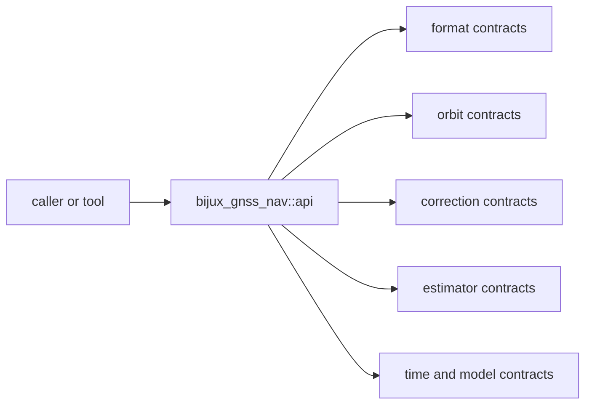

# Interfaces

Open this section when the question is contractual: which decoders, orbit
records, correction helpers, estimator types, and time surfaces are safe for
another crate or tool to rely on.

## Contract Surface

`bijux-gnss-nav` publishes one curated public surface through
`bijux_gnss_nav::api`, but that surface spans several real contract families:
product parsing, orbit state, corrections, positioning and integrity, PPP,
RTK, models, and time interpretation.

## Read These First

- open [Foundation](../foundation/) first if the question is whether a public
  surface belongs in nav at all
- stay in this section when the question is whether an export, record, or
  helper deserves a durable public promise

## First Proof Check

- `crates/bijux-gnss-nav/src/api.rs`
- `crates/bijux-gnss-nav/API.md`
- `crates/bijux-gnss-nav/docs/PUBLIC_API.md`
