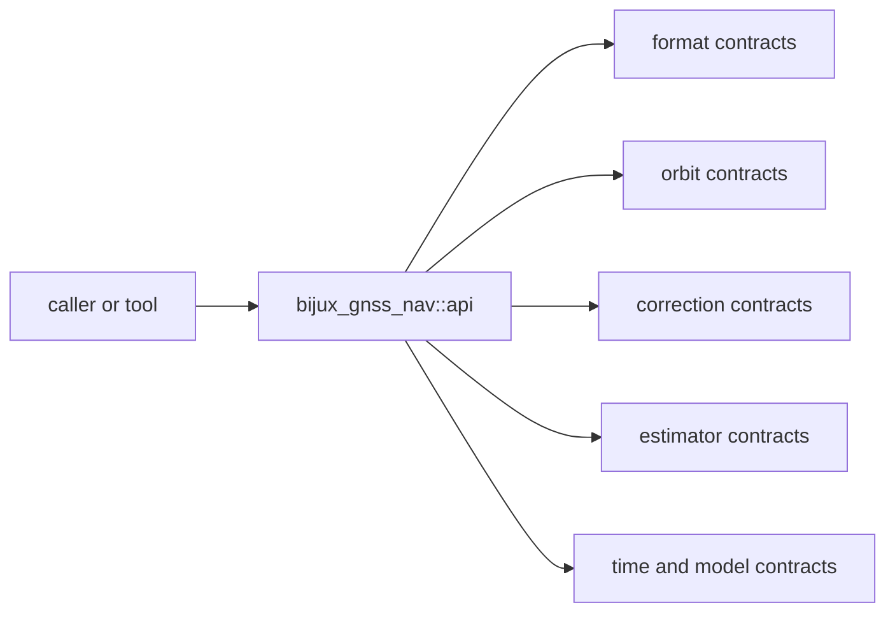

# Interfaces

Open this section when the question is contractual: which decoders, orbit
records, correction helpers, estimator types, and time surfaces are safe for
another crate or tool to rely on.

## Contract Surface

`bijux-gnss-nav` publishes one curated public surface through
`bijux_gnss_nav::api`, but that surface spans several real contract families:
product parsing, orbit state, corrections, positioning and integrity, PPP,
RTK, models, and time interpretation.

## Read These First

- open [API Surface](api-surface.md) first when the question is whether a
  type or helper should be part of the durable navigation boundary
- open [Format And Product Contracts](format-and-product-contracts.md) when the
  issue starts from navigation messages, RINEX, or precise products
- open [Estimation Contracts](estimation-contracts.md) when the issue is
  whether a solver type, refusal, or evidence record deserves public stability

## Pages In This Section

- [API Surface](api-surface.md)
- [Public Imports](public-imports.md)
- [Format And Product Contracts](format-and-product-contracts.md)
- [Orbit Contracts](orbit-contracts.md)
- [Correction Contracts](correction-contracts.md)
- [Estimation Contracts](estimation-contracts.md)
- [Time And Model Contracts](time-and-model-contracts.md)
- [Entrypoints And Examples](entrypoints-and-examples.md)
- [Compatibility Commitments](compatibility-commitments.md)

## First Proof Check

- `crates/bijux-gnss-nav/src/api.rs`
- `crates/bijux-gnss-nav/API.md`
- `crates/bijux-gnss-nav/docs/PUBLIC_API.md`

## Leave This Section When

- leave for [Foundation](../foundation/) when the question is whether a public
  surface belongs in nav at all
- leave for [Architecture](../architecture/) when the contract issue reveals
  structural drift underneath it
- leave for [Operations](../operations/) or [Quality](../quality/) when the
  public shape is clear and the question becomes safe change or proof
