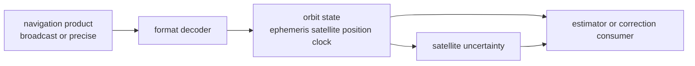

# Orbit Contracts

Orbit contracts define the typed satellite-state and ephemeris meaning consumed
by correction families, position solvers, PPP, RTK, and validation reports. The
contract begins after navigation-product bytes are decoded into domain records
and ends before receiver scheduling or repository persistence.

## Orbit State Flow

## Owned Surfaces

| surface | owner path | reader promise |
| --- | --- | --- |
| GPS broadcast orbit | `crates/bijux-gnss-nav/src/orbits/gps.rs` | GPS ephemeris becomes typed satellite state |
| Galileo broadcast orbit | `crates/bijux-gnss-nav/src/orbits/galileo.rs` | Galileo ephemeris follows navigation-domain rules |
| BeiDou broadcast orbit | `crates/bijux-gnss-nav/src/orbits/beidou.rs` | BeiDou ephemeris uses its own constellation law |
| GLONASS orbit state | `crates/bijux-gnss-nav/src/orbits/glonass.rs` | FDMA and GLONASS-specific state stay explicit |
| shared broadcast helpers | `crates/bijux-gnss-nav/src/orbits/broadcast_orbit.rs` | common broadcast-orbit behavior is reused deliberately |
| uncertainty | `crates/bijux-gnss-nav/src/orbits/satellite_uncertainty.rs` | orbit quality reaches downstream estimators as typed evidence |

## Boundary Decisions

- File discovery and dataset placement belong to infra before decoded product
  bytes reach nav.
- Receiver acquisition, tracking, and observation scheduling belong to receiver
  after nav returns typed state or refusal evidence.
- Coordinate, unit, and time record semantics come from core, but
  constellation-specific orbit interpretation belongs here.
- A precise-product provider seam is part of nav when it supplies satellite
  state; repository storage for that product remains infra.

## First Proof Check

Inspect `crates/bijux-gnss-nav/src/orbits/`,
`crates/bijux-gnss-nav/docs/ORBITS.md`,
`crates/bijux-gnss-nav/tests/integration_broadcast_orbit_reference.rs`,
`crates/bijux-gnss-nav/tests/integration_broadcast_orbit_accuracy.rs`,
`crates/bijux-gnss-nav/tests/integration_glonass_broadcast_orbit_reference.rs`,
and `crates/bijux-gnss-nav/tests/integration_sp3_reference_accuracy.rs`.
