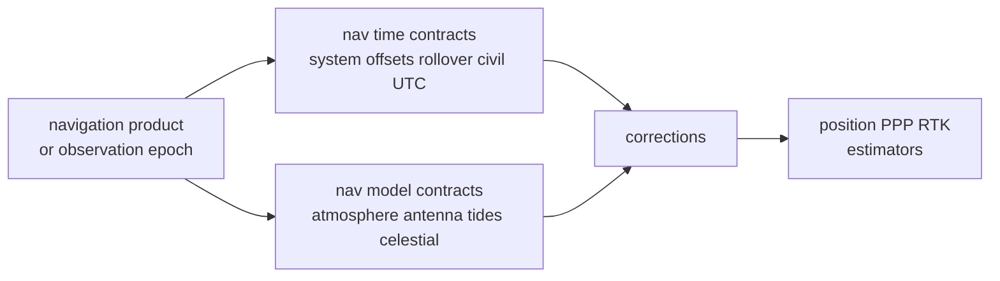

# Time and Model Contracts

Time and model contracts keep navigation science reproducible after data leaves
the parser or receiver boundary. Core owns foundational time records. Nav owns
GNSS-specific time interpretation, rollover resolution, and the physical models
that corrections and estimators depend on.

## Navigation Support Flow

## Time Surface

| surface | nav meaning | required proof |
| --- | --- | --- |
| `GnssTimeSystem` | explicit system identity for GPST, GST, BDT, GLONASS, UTC, and TAI | conversion tests |
| `TimeOffsetEvidence` | source-labelled offset evidence between time systems | serialization and conversion tests |
| `TimeConversion<T>` | converted value plus the evidence used to convert it | API and integration tests |
| `UtcCivilTime` | civil-time parsing and formatting for navigation products | leap-second tests |
| Galileo and BeiDou time records | week and time-of-week representation after navigation interpretation | broadcast decode tests |
| GLONASS time records | day index and seconds-of-day interpretation | GLONASS day-resolution tests |
| rollover helpers | GPS, Galileo, BeiDou week rollover and GLONASS four-year day cycle resolution | rollover boundary tests |

## Model Surface

| surface | nav meaning | consumer |
| --- | --- | --- |
| atmosphere and NeQuick models | troposphere and ionosphere support used by corrections | position, PPP, diagnostics |
| antenna models | receiver and satellite phase-center correction evidence | PPP and RTK |
| celestial models | sun and moon support for physical effects | tide and phase models |
| ocean tide loading | station displacement support | precise positioning |
| solid earth tide | solid-earth displacement support | precise positioning |

## Boundary Decisions

- Keep generic epoch and serialization meaning in core.
- Keep parser-local bit extraction in format modules, then hand resolved time
  evidence to the nav time surface.
- Keep physical models here only when they support navigation corrections or
  estimators.
- Keep repository run layout, artifact placement, and inspection workflows in
  infra.
- Treat missing reference-week, reference-day, leap-second, or model-source
  evidence as a correctness issue, not a presentation issue.

## First Proof Check

Inspect `crates/bijux-gnss-nav/src/time.rs`,
`crates/bijux-gnss-nav/src/time/rollover.rs`,
`crates/bijux-gnss-nav/src/models/`,
`crates/bijux-gnss-nav/docs/TIME.md`,
`crates/bijux-gnss-nav/docs/MODELS.md`,
`crates/bijux-gnss-nav/tests/integration_time_system_conversions.rs` and
`crates/bijux-gnss-nav/tests/integration_troposphere_elevation.rs` to confirm
navigation-specific time interpretation and physical models still match checked
scientific proof.
