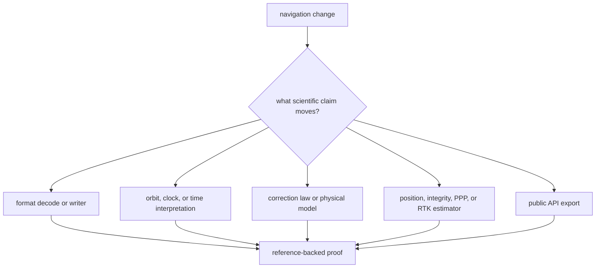

# Change Sequence

Use this sequence when a navigation-science change affects decoded products,
orbit or time interpretation, correction models, estimator behavior, public API
exports, or the evidence reported to higher crates.

## Claim Routing

## Recommended Sequence

1. Name the scientific claim that changed.
2. Read the crate-local doc for that claim before editing.
3. Confirm the behavior belongs in `bijux-gnss-nav`, not receiver scheduling,
   repository IO, or command orchestration.
4. Keep parsing, model math, correction policy, and estimator behavior in their
   owning modules.
5. Run the narrowest reference-backed proof before broad checks.
6. Commit only after the claim, docs, and proof agree.

## Why The Sequence Matters

This crate is broad enough that one "small" solver or parser edit can have
public consequences. Committing by scientific intent keeps reviewable history
aligned with package meaning.

## Proof Selection

| changed claim | read first | proof style |
| --- | --- | --- |
| RINEX, navigation message, or precise-product format | `crates/bijux-gnss-nav/docs/FORMATS.md` | parser or writer test with representative input |
| ephemeris, orbit, clock, or rollover interpretation | `ORBITS.md` and `TIME.md` | constellation-specific orbit or time test |
| atmosphere, bias, combination, or tide model | `CORRECTIONS.md` and `MODELS.md` | correction test with expected numeric behavior |
| SPP, integrity, PPP, RTK, or EKF behavior | `ESTIMATION.md` | solver, integrity, or estimator integration test |
| public export or downstream contract | `PUBLIC_API.md` and `CONTRACTS.md` | API compile proof plus owner-specific behavior test |

## Reader Check

The final diff should make the changed scientific claim obvious. A reviewer
should not have to infer whether the edit changes parsing, physics, estimation,
or presentation.
