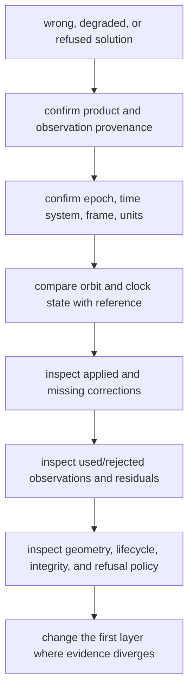
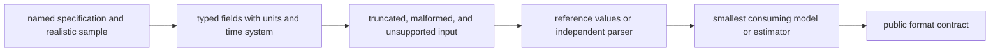
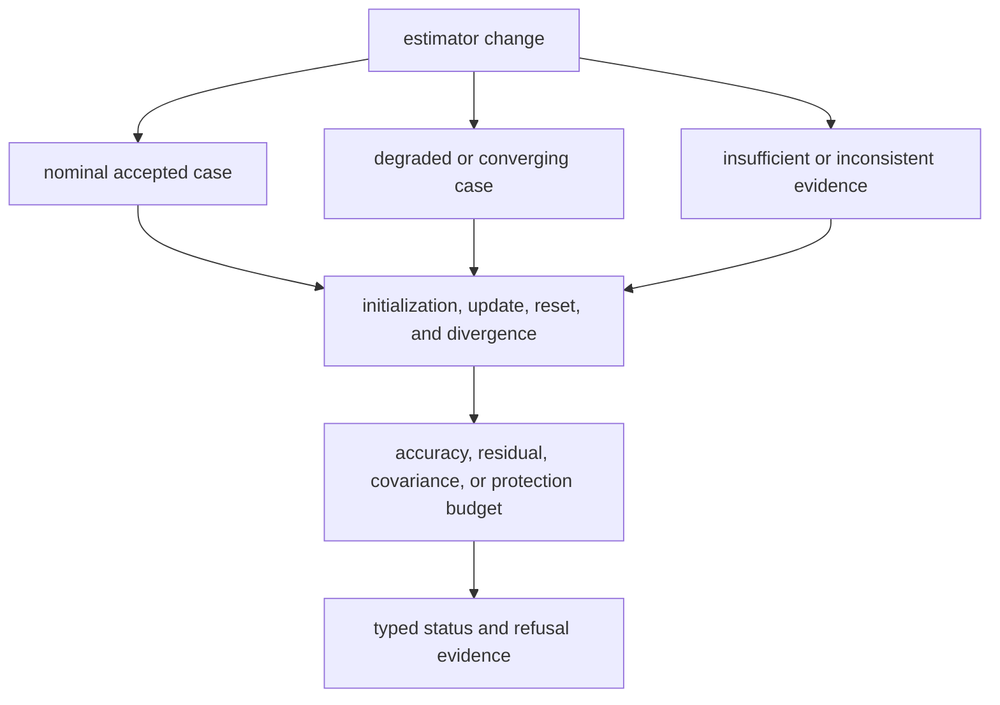

# Common Workflows

Begin navigation work with the claim that is wrong, missing, or unsupported.
The same observed position error can originate in parsing, time conversion,
orbit state, correction sign, measurement selection, estimator state, or
integrity policy. Editing the nearest caller before locating that cause usually
creates a second error.

## Diagnose A Wrong Solution

Do not begin by tuning thresholds. First preserve the failing case and identify
the earliest divergence from independent truth. A downstream position can look
plausible even when time, frame, or correction provenance is wrong.

Useful routes:

- [time interpretation](../../../crates/bijux-gnss-nav/docs/TIME.md);
- [orbit and clock behavior](../../../crates/bijux-gnss-nav/docs/ORBITS.md);
- [correction assumptions](../../../crates/bijux-gnss-nav/docs/CORRECTIONS.md);
- [estimator and integrity behavior](../../../crates/bijux-gnss-nav/docs/ESTIMATION.md).

## Add Or Change A Product Decoder

1. Name the product revision, constellation, record family, and unsupported
   variants.
2. Decode into navigation-owned types with explicit units, frame, epoch, and
   provenance.
3. Add rejection or partial-support evidence before adding downstream use.
4. Compare representative values against a public reference or independent
   parser where possible.
5. Exercise the smallest consumer that relies on the changed field.
6. Update the [format contract](../../../crates/bijux-gnss-nav/docs/FORMATS.md)
   when caller-visible interpretation changes.

Repository discovery and active-product selection remain outside the parser.

## Introduce Or Change A Correction

State the uncorrected observable, correction sign, units, applicability,
required products, uncertainty contribution, and behavior when prerequisites
are absent. Prove:

- zero or neutral conditions;
- a reference case with nonzero expected effect;
- invalid, missing, or incompatible inputs;
- the downstream residual or solution effect only if the public claim changes.

Keep reusable physical law in navigation. Keep signal carrier and component
facts in signal, shared record meaning in core, and product location in
infrastructure. The [model guide](../../../crates/bijux-gnss-nav/docs/MODELS.md)
and [correction guide](../../../crates/bijux-gnss-nav/docs/CORRECTIONS.md)
separate those responsibilities.

## Change Estimator Or Integrity Behavior

An estimator change is incomplete if it proves only a successful point.
Exercise the relevant lifecycle and refusal conditions: insufficient
observations, invalid products, weak geometry, incomplete corrections,
divergence, failed ambiguity acceptance, or unavailable integrity evidence.

Use the [navigation completion gate](../quality/definition-of-done.md) to record
the exact scientific claim and evidence.

## Change A Public Contract

Review semantic compatibility even if downstream code still compiles. Units,
defaults, status ordering, refusal classes, serialized fields, and feature
expectations can change behavior without changing a function name.

1. Confirm the type or function is navigation-owned.
2. Inspect direct receiver and command consumers.
3. Preserve typed status, uncertainty, provenance, and refusal.
4. Add public-route evidence rather than testing a private module.
5. Update the
   [public API contract](../../../crates/bijux-gnss-nav/docs/PUBLIC_API.md) and
   [compatibility commitments](../interfaces/compatibility-commitments.md).

## Close The Workflow

The change record should identify input provenance, constellation or product
scope, units, frame, time system, feature set, positive tolerance, negative
cases, and the first layer where behavior changed. Link the focused evidence and
state any missing independent or long-duration proof.

The [navigation test strategy](../quality/test-strategy.md) explains when
fixture, reference, lifecycle, and public-data evidence are required.
