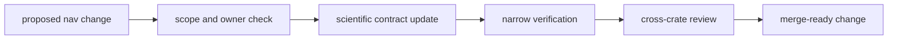

# Operations

Open this section when the question is how to change `bijux-gnss-nav` without
quietly moving scientific meaning, broadening public contracts carelessly, or
breaking reference-backed trust.

## Operational Model

## Read These First

- open [Change Sequence](change-sequence.md) first when the work touches
  formats, corrections, orbit logic, or any estimator family
- open [Verification Commands](verification-commands.md) when you need the
  narrowest executable proof for a local change
- open [Review Scope](review-scope.md) when a change seems to affect more than
  one scientific family at once

## Pages In This Section

- [Common Workflows](common-workflows.md)
- [Local Development](local-development.md)
- [Change Sequence](change-sequence.md)
- [Verification Commands](verification-commands.md)
- [Precise Product And Fixture Care](precise-product-and-fixture-care.md)
- [Review Scope](review-scope.md)
- [Release And Versioning](release-and-versioning.md)

## First Proof Check

- `crates/bijux-gnss-nav/README.md`
- `crates/bijux-gnss-nav/docs/TESTS.md`
- `crates/bijux-gnss-nav/tests/`

## Leave This Section When

- leave for [Interfaces](../interfaces/) when the question is what nav
  promises rather than how to change it safely
- leave for [Quality](../quality/) when the operational sequence is clear and
  the next question is proof sufficiency
