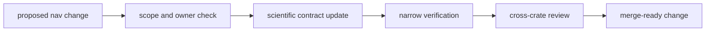

# Operations

Open this section when the question is how to change `bijux-gnss-nav` without
quietly moving scientific meaning, broadening public contracts carelessly, or
breaking reference-backed trust.

## Operational Model

## Read These First

- open [Foundation](../foundation/) first if the change may belong in another
  crate
- stay in this section when the ownership is clear and the real question is
  how to edit a scientific package safely

## First Proof Check

- `crates/bijux-gnss-nav/README.md`
- `crates/bijux-gnss-nav/docs/TESTS.md`
- `crates/bijux-gnss-nav/tests/`
