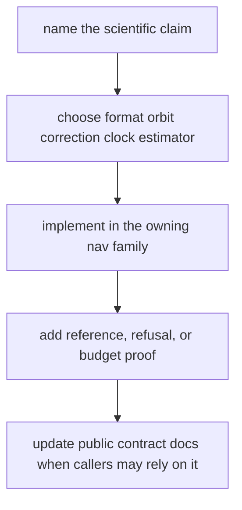

# Navigation Extension Guide

Use this guide when adding navigation-domain behavior: product decoding, orbit
state, correction law, clock handling, estimator behavior, PPP, RTK, or
scientific refusal evidence. If the work is signal substrate, receiver runtime,
repository persistence, or command presentation, leave this crate.

## Extension Route

## Choose The Owner

| extension | owning area | required proof |
| --- | --- | --- |
| product decoder | `src/formats/` | valid product fixture and typed rejection case |
| orbit state | `src/orbits/` | broadcast or precise reference comparison |
| correction model | `src/corrections/` | nominal correction and refusal or quality evidence |
| satellite clock behavior | clock/product owner used by orbit or estimator path | broadcast fallback and precise override proof |
| position estimator behavior | `src/estimation/position/` | solver quality, residual, or integrity proof |
| PPP behavior | `src/estimation/ppp/` | state lifecycle, precise-product, or convergence proof |
| RTK behavior | `src/estimation/rtk/` | ambiguity, baseline, fix policy, or quality proof |

## Extension Gates

- Name the physical or statistical claim before adding the module.
- Keep reusable filter primitives under `src/estimation/ekf/` only when more
  than one estimator family consumes them.
- Add refusal, downgrade, or integrity evidence whenever an algorithm can fail
  honestly.
- Keep file discovery in infra and runtime scheduling in receiver.
- Update public API docs only when another crate is expected to depend on the
  new surface.

## Existing Owner Patterns

- Correction examples: `broadcast_ionosphere_residuals.rs`,
  `dual_frequency.rs`, `measured_ionosphere.rs`, `phase_windup.rs`,
  `iono_free_code.rs`, and `narrow_lane.rs`.
- Clock/product examples: precise CLK and broadcast clock tests prove fallback
  and override behavior.
- Estimator examples: position, PPP, and RTK subtrees separate reusable
  primitives from solver-family policy.

## First Proof Check

Inspect `crates/bijux-gnss-nav/docs/CONTRACTS.md`,
`crates/bijux-gnss-nav/docs/FORMATS.md`,
`crates/bijux-gnss-nav/docs/CORRECTIONS.md`,
`crates/bijux-gnss-nav/docs/ESTIMATION.md`,
`crates/bijux-gnss-nav/docs/TESTS.md`, and the closest integration test under
`crates/bijux-gnss-nav/tests/`.
