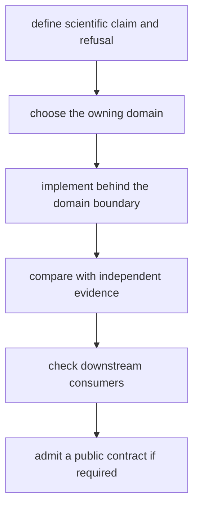

# Navigation Extension Guide

Use this guide when adding navigation-domain behavior: product decoding, orbit
state, correction law, clock handling, estimator behavior, PPP, RTK, or
scientific refusal evidence. If the work is signal substrate, receiver runtime,
repository persistence, or command presentation, leave this crate.

## Define the Claim First

Before choosing a module or API, write down:

- the input product or observation and its provenance
- constellation, signal, time system, coordinate frame, and units
- the physical or statistical behavior being added
- required products, geometry, state, and quality thresholds
- successful, degraded, and refused outcomes
- the independent reference or invariant that can distinguish a correct result
  from a plausible one

If these are unknown, implementation is premature.

## Extension Route

## Choose the Owner

| extension | owning boundary | minimum evidence |
| --- | --- | --- |
| product decoder or writer | [format boundary](../../../crates/bijux-gnss-nav/src/formats.rs) | realistic valid fixture, malformed input, time context, and round-trip or reference interpretation |
| orbit or satellite state | [orbit boundary](../../../crates/bijux-gnss-nav/src/orbits/mod.rs) | broadcast or precise reference, frame and time assumptions, error budget, and unavailable-product behavior |
| correction or combination | [correction boundary](../../../crates/bijux-gnss-nav/src/corrections/mod.rs) | independent formula or dataset, units, nominal effect, invalid combination, and missing-context refusal |
| environmental or antenna model | [model boundary](../../../crates/bijux-gnss-nav/src/models/mod.rs) | model-domain bounds, reference values, required environmental context, and out-of-domain behavior |
| reusable filter primitive | [EKF boundary](../../../crates/bijux-gnss-nav/src/estimation/ekf/mod.rs) | numerical properties independent of one solver family and explicit covariance assumptions |
| position or RAIM behavior | [position boundary](../../../crates/bijux-gnss-nav/src/estimation/position/mod.rs) | accuracy, residuals, uncertainty, integrity, outlier behavior, and impossible-geometry refusal |
| PPP behavior | [PPP boundary](../../../crates/bijux-gnss-nav/src/estimation/ppp/mod.rs) | product prerequisites, state lifecycle, convergence, quality downgrade, and refusal |
| RTK behavior | [RTK boundary](../../../crates/bijux-gnss-nav/src/estimation/rtk/mod.rs) | differencing, ambiguity state, baseline truth, fix policy, quality, and refusal |
| time interpretation | [navigation time boundary](../../../crates/bijux-gnss-nav/src/time.rs) | conversion boundaries, rollover context, leap-second behavior, and ambiguous-input rejection |

## Keep Ownership Narrow

- File discovery and repository lookup remain in infrastructure.
- Sample flow, channel state, and stage scheduling remain in receiver.
- Signal identity and code generation remain in signal.
- Shared units, identifiers, and result records remain in core.
- Command arguments and report wording remain in the facade.
- Reusable filter primitives belong in the EKF boundary only when more than one
  estimator family needs the same mathematical contract.

## Build the Evidence

Use the nearest package guide before changing behavior:

- [format contracts](../../../crates/bijux-gnss-nav/docs/FORMATS.md) for product
  syntax, context, and typed rejection
- [orbit contracts](../../../crates/bijux-gnss-nav/docs/ORBITS.md) for state,
  clock, uncertainty, and product gaps
- [correction contracts](../../../crates/bijux-gnss-nav/docs/CORRECTIONS.md) for
  provenance, units, combinations, and missing context
- [estimation contracts](../../../crates/bijux-gnss-nav/docs/ESTIMATION.md) for
  accepted, degraded, and refused claims
- [time contracts](../../../crates/bijux-gnss-nav/docs/TIME.md) for reference
  weeks, rollover, and time-system conversion
- [test evidence](../../../crates/bijux-gnss-nav/docs/TESTS.md) for reference,
  public-data, integrity, and stability proof families

Do not generate expected values from the implementation under test. A changed
tolerance must name the uncertainty or reference limitation that justifies the
new bound.

## Admit the Public Surface

Add an export only when another crate needs a durable navigation contract.
Document it in the [public API guide](../../../crates/bijux-gnss-nav/docs/PUBLIC_API.md),
record scientific and compatibility impact in the
[package release history](../../../crates/bijux-gnss-nav/CHANGELOG.md), and
review downstream receiver, infrastructure, and facade presentation.
