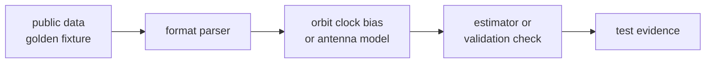

# Precise Product and Fixture Care

`bijux-gnss-nav` relies on public-data, golden, and precise-product fixtures
that carry scientific meaning, not only test convenience.

## Fixture Evidence Flow

## Care Rules

| fixture family | care requirement | first proof |
| --- | --- | --- |
| SP3 | preserve orbit reference meaning and epoch alignment | SP3 reference accuracy tests |
| CLK | preserve clock product timing and interpolation assumptions | CLK reference accuracy tests |
| ANTEX | preserve antenna calibration meaning and frequency mapping | ANTEX parser and model tests |
| bias SINEX | preserve signal-bias source, units, and time window | bias parser and correction tests |
| broadcast decoder fixtures | preserve constellation-specific bit and field meaning | GPS, Galileo, BeiDou, and GLONASS decoder tests |
| public station truth | preserve coordinate frame, reference epoch, and accepted tolerance rationale | public-data and station-truth tests |

## Change Discipline

- Explain whether changed behavior means the code was wrong, the expectation was
  wrong, or the external product assumption changed.
- Do not broaden tolerances only to make a reference test green.
- Keep parser fixtures with parser proof and solver fixtures with estimator
  proof.
- Preserve provenance for public-data and precise-product files.
- Update tests and docs together when a fixture changes the scientific claim.

## First Proof Check

Inspect `crates/bijux-gnss-nav/docs/FORMATS.md`,
`crates/bijux-gnss-nav/docs/ORBITS.md`,
`crates/bijux-gnss-nav/docs/TESTS.md`,
`crates/bijux-gnss-nav/tests/integration_sp3_reference_accuracy.rs`,
`crates/bijux-gnss-nav/tests/integration_clk_reference_accuracy.rs`, and the
fixture-backed parser tests for the changed product family.
