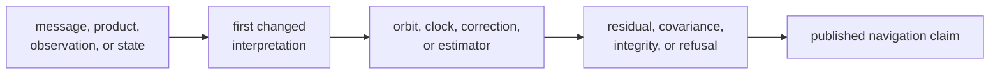
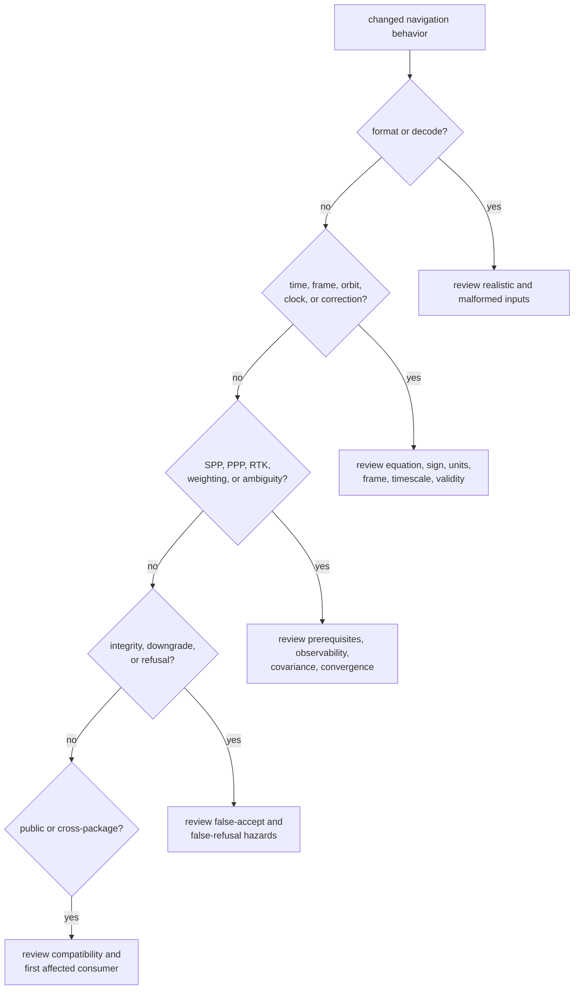

# Reviewing Navigation Changes

Review navigation changes by the claim they alter, not by line count. A
one-line sign, timescale, covariance, or acceptance-threshold change can alter
every solution. A larger internal rearrangement may preserve all scientific
meaning. The reviewer’s job is to locate the first changed interpretation,
trace it to the published claim, and judge the evidence at each boundary.

## Establish the Scientific Claim

Start by writing one sentence that can be tested:

> For these inputs, in this frame, timescale, and unit system, the implementation
> produces this bounded result or this explicit refusal.

If the change cannot be expressed that way, its scientific scope is not yet
clear enough to review.

Find the first arrow whose meaning changed. Begin detailed review there; do not
start at the final CLI text or at the file with the largest diff.

## Size the Review by Risk

| Risk dimension | Lower reach | Higher reach |
| --- | --- | --- |
| scientific ownership | private helper inside one parser or model | shared time, frame, orbit, correction, weighting, or estimator primitive |
| accepted inputs | same formats and prerequisites | new format, constellation, signal pair, product source, or fallback |
| result semantics | same value, units, and state | changed solution, residual, covariance, protection level, downgrade, or refusal |
| numerical behavior | algebraically equivalent with bounded comparison | changed equation, iteration, threshold, convergence, conditioning, or tolerance |
| compatibility | private representation | public type, feature behavior, serialized record, diagnostic, or stable identifier |
| consumer reach | one navigation family | receiver, infrastructure, command, or release-facing output |
| evidence | independent reference already covers the case | new fixture, self-generated expected value, or missing negative case |

Any item in the higher-reach column broadens the review. Several such items
usually require separate owners for format, estimation, integrity, and consumer
behavior even when the implementation is compact.

## Follow the Meaning, Not the Call Graph

### Format and message interpretation

Check field width, scale, sign, sentinel values, issue-of-data identity, epoch,
timescale, rollover, and malformed-input behavior. A parser round trip does not
prove the decoded state is physically correct. Require a realistic fixture or
an independently derived vector and follow the decoded value into its first
orbit, clock, correction, or estimator use.

### Orbit, clock, time, and correction models

Write down the equation and convention being implemented. Review signs, units,
reference frame, timescale, interpolation interval, validity window, and
out-of-range behavior. Compare against a source independent of the production
implementation. A numerically small residual can still conceal the wrong frame
or epoch.

### SPP, PPP, and RTK estimation

Review observation prerequisites, state definition, initialization, process and
measurement covariance, weighting, outlier policy, convergence criteria, and
reported uncertainty. For PPP and RTK, inspect transitions between unavailable,
float, converging, fixed, downgraded, and refused states. A favorable final
coordinate is insufficient if the state history or ambiguity evidence is
wrong.

### Integrity and refusal

Treat acceptance as a safety claim. Review both hazards:

- false acceptance: an unsupported or inconsistent solution is reported as
  valid
- false refusal: adequate data is rejected or a valid claim is needlessly
  downgraded

Threshold changes need evidence immediately below, at, and above the boundary.
The result must preserve the failed prerequisite, excluded measurement, fault
hypothesis, or unresolved ambiguity rather than collapsing it into a generic
error.

## Check the Contract Surface

A scientific edit becomes a compatibility review when it changes:

- a public type, method, enum, field, unit, or stable identifier
- a default feature or behavior when precise products are unavailable
- solution, downgrade, integrity, ambiguity, residual, or refusal evidence
- ordering or identity used by persisted reports
- assumptions consumed by receiver, infrastructure, or command packages

The [public navigation API](../../../crates/bijux-gnss-nav/src/api.rs) is the
export boundary, not a list of everything that happens to be public inside a
module. New exports need a durable cross-package use case. Removing or changing
an export needs a migration decision, not only a compile fix in the workspace.

## Judge the Evidence

Strong review evidence answers all of these questions:

| Question | Expected evidence |
| --- | --- |
| What independent source defines the expected behavior? | specification, public product, station truth, trusted reference output, or separately implemented equation |
| What input is covered? | constellation, product, station, epoch, geometry, feature set, and provenance |
| What conventions apply? | frame, timescale, units, sign, and correction set |
| What is compared? | exact identity or a named physical metric with a justified tolerance |
| What is rejected? | malformed, stale, unsupported, singular, unobservable, or integrity-failed input |
| What consumes the result? | first estimator or downstream package whose interpretation could change |
| What remains unproved? | untested constellation, product, geometry, outage, duration, or operating mode |

Expected values copied from the new implementation establish regression
stability only. They are not independent accuracy evidence. Likewise, widening
a tolerance because a test failed transfers uncertainty into the contract
unless a numerical or physical budget justifies the new bound.

## Review Sequence

1. State the changed scientific claim and its owner.
2. Inspect the independent reference before the implementation details.
3. Trace units, frame, timescale, identity, and validity through the first
   changed interpretation.
4. Review invalid, unavailable, and boundary inputs before the nominal result.
5. Inspect residual, covariance, integrity, downgrade, and refusal evidence.
6. Follow public meaning to the first affected consumer.
7. Match tests to each changed claim and record any expensive proof not run.
8. Re-read the diff for accidental public exports, weakened assertions, fixture
   replacement, tolerance growth, or hidden fallback.

## Reasons to Block

Block the change when:

- the frame, timescale, units, sign, or product provenance is implicit
- production output generated its own only expected result
- accepted output can conceal missing prerequisites or failed integrity
- a new fallback silently weakens the solution claim
- a threshold changed without boundary evidence and hazard analysis
- malformed, stale, singular, or unsupported input lacks a typed outcome
- a public or persisted contract changed without compatibility treatment
- the first affected estimator or downstream consumer was not examined
- an expensive scenario was shortened or a tolerance loosened only to obtain a
  pass

## Review References

- [Navigation package boundary](../../../crates/bijux-gnss-nav/docs/BOUNDARY.md)
  defines which scientific decisions belong in this crate.
- [Format ownership](../../../crates/bijux-gnss-nav/docs/FORMATS.md) covers
  navigation messages and reference-product parsing.
- [Estimation ownership](../../../crates/bijux-gnss-nav/docs/ESTIMATION.md)
  covers SPP, PPP, RTK, integrity, and refusal.
- [Navigation proof inventory](../../../crates/bijux-gnss-nav/docs/TESTS.md)
  maps fixtures and major test families.
- [Navigation verification guide](verification-commands.md) routes changed
  claims to focused and broad proof.
- [Navigation invariants](../quality/invariants.md) defines enduring frame,
  time, uncertainty, provenance, and refusal rules.
