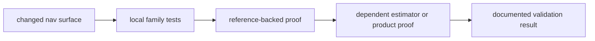

# Change Validation

Use the smallest honest validation set that proves the changed scientific
intent.

## Validation Flow

## Minimum Validation By Change Type

| change type | minimum validation |
| --- | --- |
| parser change | owning format-family tests plus one reference-backed product test when applicable |
| orbit or time change | relevant reference tests plus one downstream estimator check when the state feeds solvers |
| correction change | correction-family tests plus one dependent position, PPP, or RTK test |
| estimator change | local solver-family tests plus narrow integration tests that prove public behavior |
| refusal or integrity change | refusal-path tests and evidence inspection for the rejected condition |

## Bad Validation Patterns

- only running a broad integration test for a low-level change
- only running unit-like tests for a public solver behavior change
- accepting green tests without checking whether the affected scientific family
  was actually exercised

## Review Checks

- Which scientific claim changed?
- Which proof exercises that claim directly?
- What refusal or uncertainty evidence protects readers from over-trusting a
  solution?
