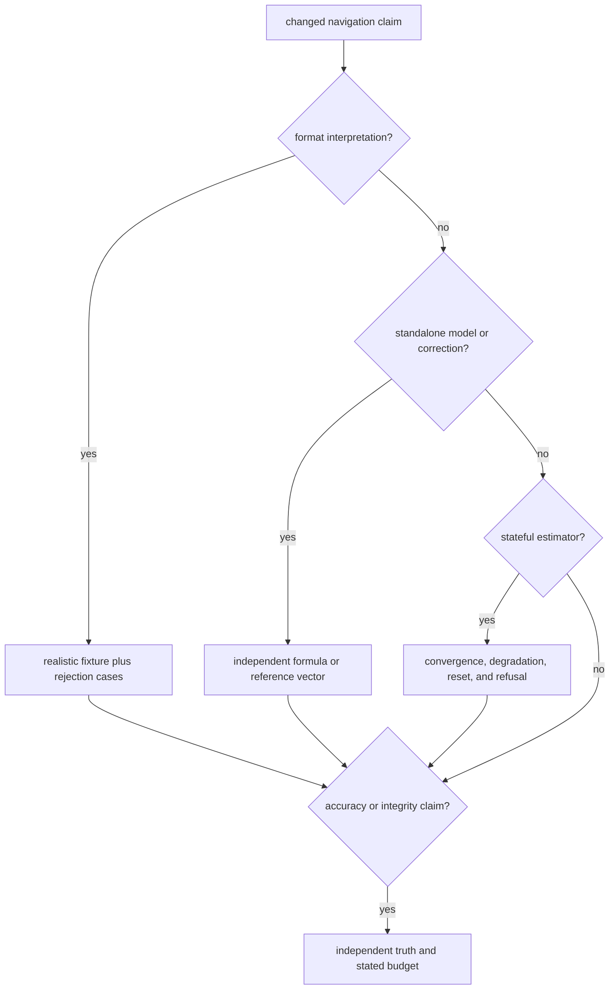

# Definition Of Done

A navigation change is complete when its scientific claim is bounded by
inputs, frames, time systems, model assumptions, acceptance policy, and
reference evidence. Parser success, a finite numerical result, and an accepted
position are different claims and need different proof.

## Scientific Completion Chain

```mermaid
flowchart LR
    input["product or observation contract"]
    interpretation["units, frame, time, and provenance"]
    model["model or correction"]
    estimator["estimator or integrity policy"]
    decision["solution, degraded result, or refusal"]
    reference["independent evidence"]
    complete["bounded documented claim"]

    input --> interpretation
    interpretation --> model
    model --> estimator
    estimator --> decision
    decision --> reference
    reference --> complete
```

A change may stop before the estimator, but it may not skip the links it
affects. For example, a parser change still needs malformed-input behavior and
physical field interpretation even if no position solver runs.

## Completion By Scientific Surface

| changed surface | positive evidence | negative or boundary evidence | reader-visible record |
| --- | --- | --- | --- |
| navigation message or product parser | realistic record decodes into expected typed fields | malformed, truncated, unsupported, and ambiguous records are rejected or represented explicitly | format, units, time system, provenance, and support scope |
| orbit, clock, time, or coordinate transform | result agrees with an independent reference at stated tolerance | rollover, interpolation edge, invalid epoch, or frame mismatch behavior | reference source, epoch range, frame, and numerical tolerance |
| atmosphere, antenna, bias, or signal combination | correction sign, units, applicability, and uncertainty agree with reference behavior | missing frequency, lock, bias, calibration, or product remains distinguishable | assumptions and conditions under which correction is applied |
| SPP or filtered positioning | accepted solution meets accuracy, residual, geometry, and lifecycle expectations | insufficient observations, invalid ephemeris, unknown time offset, or divergence yields typed refusal | status, validity, uncertainty, used/rejected measurements, and refusal |
| PPP or RTK | readiness, float/fixed state, corrections, covariance, and ambiguity evidence are coherent | incomplete corrections, weak geometry, failed ratio, reference change, or unsupported mode does not become a strong claim | maturity, execution status, provenance, and downgrade reason |
| integrity or protection level | alarm and protection behavior matches the stated threat and probability model | unavailable or inconsistent evidence refuses integrity rather than reporting reassuring numbers | hypotheses, exclusions, thresholds, and integrity status |
| public API or feature | caller compiles through the documented surface with intended features | behavior without `precise-products` is understood and tested where affected | feature set and compatibility impact |

The package declares `precise-products` and enables it by default, but the
current navigation source does not gate implementation with that feature.
Therefore the feature declaration alone must not be cited as proof that a
precise-product path is enabled or disabled. If behavior is attached to the
feature, the same change must add enabled and disabled proof, document the API
shape, and update downstream receiver feature expectations.

## Select Evidence Without Overclaiming

The [navigation test strategy](test-strategy.md) explains evidence independence
and the [crate test map](../../../crates/bijux-gnss-nav/docs/TESTS.md) lists the
major executable families. The [state and persistence guide](../architecture/state-and-persistence.md)
identifies which estimator state is live, checkpointed, or not represented by a
durable format.

## Ownership And Handoff

Before calling the change complete:

- place shared units and records in the
  [core ownership boundary](../../02-bijux-gnss-core/foundation/ownership-boundary.md)
  only when they are genuinely cross-domain;
- keep signal identity and waveform meaning with the
  [signal ownership boundary](../../06-bijux-gnss-signal/foundation/ownership-boundary.md);
- prove receiver-to-navigation input handling through the
  [receiver completion gate](../../05-bijux-gnss-receiver/quality/definition-of-done.md)
  when observation or handoff meaning changes;
- route durable product or solution artifacts through the
  [infrastructure persistence contract](../../03-bijux-gnss-infra/interfaces/persisted-artifact-contracts.md);
- update [public API compatibility](../interfaces/compatibility-commitments.md)
  when statuses, refusals, defaults, units, or feature availability change.

## Completion Record

The review description should state:

- the exact scientific claim and its unsupported neighboring claims;
- input provenance, constellation or product scope, frame, units, and time
  system;
- feature set and estimator configuration;
- positive tolerance or budget and the required refusal/degraded cases;
- focused evidence and any broader reference or long-duration evidence;
- missing independent data that limits the conclusion.

Do not mark a navigation change complete because output is finite or one
solution falls near a reference point. Completion requires evidence that the
right inputs produced the right claim for the right reason.
