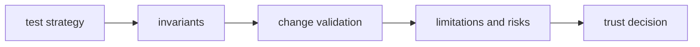

# Quality

Open this section when the question is whether `bijux-gnss-nav` is proving its
scientific claims honestly enough: invariants, test strategy, limitations,
change validation, and risk.

## Trust Model

## Read These First

- open [Foundation](../foundation/) first if the doubt is still about what the
  crate should own
- stay in this section when the boundary is clear and the next question is
  proof, risk, or limitation honesty

## First Proof Check

- `crates/bijux-gnss-nav/tests/`
- `crates/bijux-gnss-nav/docs/TESTS.md`
- crate-local docs for formats, orbits, corrections, estimation, and time
