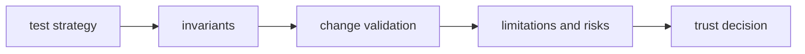

# Quality

Open this section when the question is whether `bijux-gnss-nav` is proving its
scientific claims honestly enough: invariants, test strategy, limitations,
change validation, and risk.

## Trust Model

## Read These First

- open [Test Strategy](test-strategy.md) first when you need the broad proof
  shape
- open [Invariants](invariants.md) when the question is what callers may safely
  assume about navigation behavior
- open [Change Validation](change-validation.md) when you need the minimum
  proof for a safe nav change

## Pages In This Section

- [Test Strategy](test-strategy.md)
- [Invariants](invariants.md)
- [Change Validation](change-validation.md)
- [Review Checklist](review-checklist.md)
- [Definition Of Done](definition-of-done.md)
- [Known Limitations](known-limitations.md)
- [Risk Register](risk-register.md)

## First Proof Check

- `crates/bijux-gnss-nav/tests/`
- `crates/bijux-gnss-nav/docs/TESTS.md`
- crate-local docs for formats, orbits, corrections, estimation, and time

## Leave This Section When

- leave for [Foundation](../foundation/) when the doubt is still about what the
  crate should own
- leave for [Interfaces](../interfaces/) when the real question is what public
  scientific promise exists, not how well it is defended
