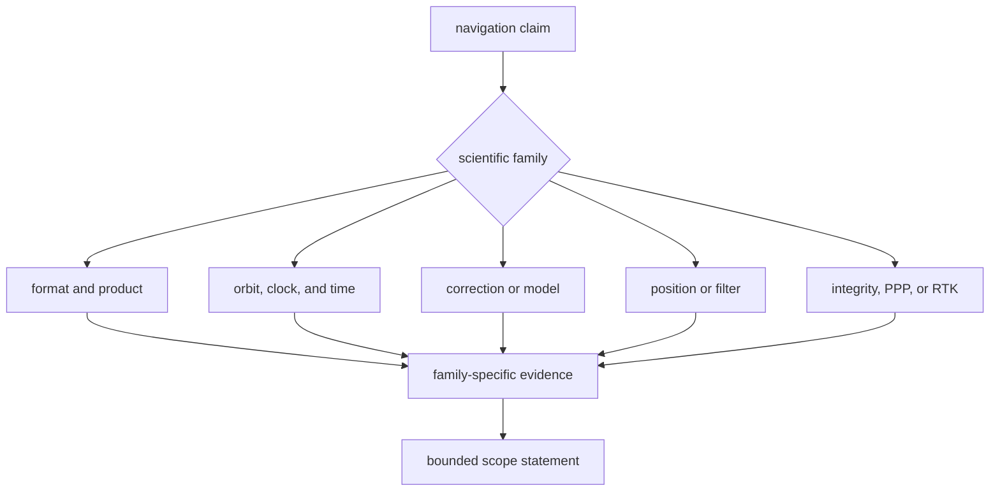
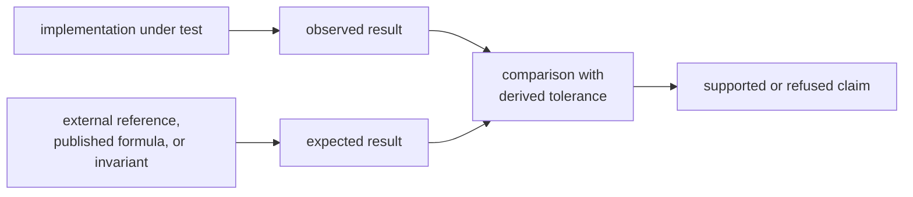

# Navigation Evidence Guide

Navigation evidence is claim-specific. Decoder acceptance, orbit accuracy,
correction behavior, estimator convergence, integrity, PPP lifecycle, and RTK
ambiguity resolution are different claims with different proof obligations.

## Route The Claim

| claim | required evidence | claim boundary |
| --- | --- | --- |
| External data is interpreted correctly | realistic accepted data, malformed cases, time context, missing fields, and semantic round trip | one format revision and constellation at a time |
| Satellite state or clock meets an accuracy budget | independent broadcast or precise reference, frame, epoch, coverage edges, and uncertainty | named product family and interval |
| A correction has the expected sign and magnitude | independent formula or dataset, units, nominal cases, domain bounds, and refusal | named model and required inputs |
| A position or filter result is valid | truth, residuals, covariance, geometry, convergence, and impossible-case refusal | named estimator and scenario |
| Integrity, PPP, or RTK supports a claim | lifecycle, quality, downgrade, ambiguity or protection evidence, and refusal | named support level, products, and fixtures |

## Evidence Must Be Independent

Generating expected values with the same parser, propagation routine,
correction, or estimator only confirms self-consistency.

Use [test strategy](test-strategy.md) to locate evidence,
[invariants](invariants.md) to state physical and result assumptions, and
[change validation](change-validation.md) to match proof to the change.

## Bound Public-Data Claims

Public station and precise-product fixtures demonstrate comparability for
selected epochs, geometries, products, atmospheric conditions, and models.
They are not universal certification. Preserve provenance and name those bounds
in every reader-facing claim.

Passing a parser test does not prove solution accuracy. Passing a standalone
position test does not prove PPP, RTK, integrity, or another constellation.
Run the estimator family that consumes the changed product or model.

## Failure Signals

- A tolerance has no physical, reference, or numerical rationale.
- Missing precise data becomes a zero correction.
- A malformed product and an unsupported claim share one generic outcome.
- Convergence is asserted without covariance, residual, or quality evidence.
- One constellation’s reference test is cited for another constellation.
- A public-data fixture lacks provenance or reference-frame context.
- A long-run test replaces focused proof for the changed scientific family.

Use [known limitations](known-limitations.md), the
[risk register](risk-register.md), [review checklist](review-checklist.md), and
[definition of done](definition-of-done.md) before broadening a claim.

## Evidence Sources

The [navigation test guide](../../../crates/bijux-gnss-nav/docs/TESTS.md) maps
the major proof families. Representative evidence includes
[broadcast orbit reference](../../../crates/bijux-gnss-nav/tests/integration_broadcast_orbit_reference.rs),
[SP3 reference accuracy](../../../crates/bijux-gnss-nav/tests/integration_sp3_reference_accuracy.rs),
[position refusal](../../../crates/bijux-gnss-nav/tests/integration_position_refusal.rs),
[public PPP convergence](../../../crates/bijux-gnss-nav/tests/integration_public_ppp_convergence.rs),
and [RTK ambiguity fixing](../../../crates/bijux-gnss-nav/tests/integration_rtk_ambiguity_fixing.rs).
