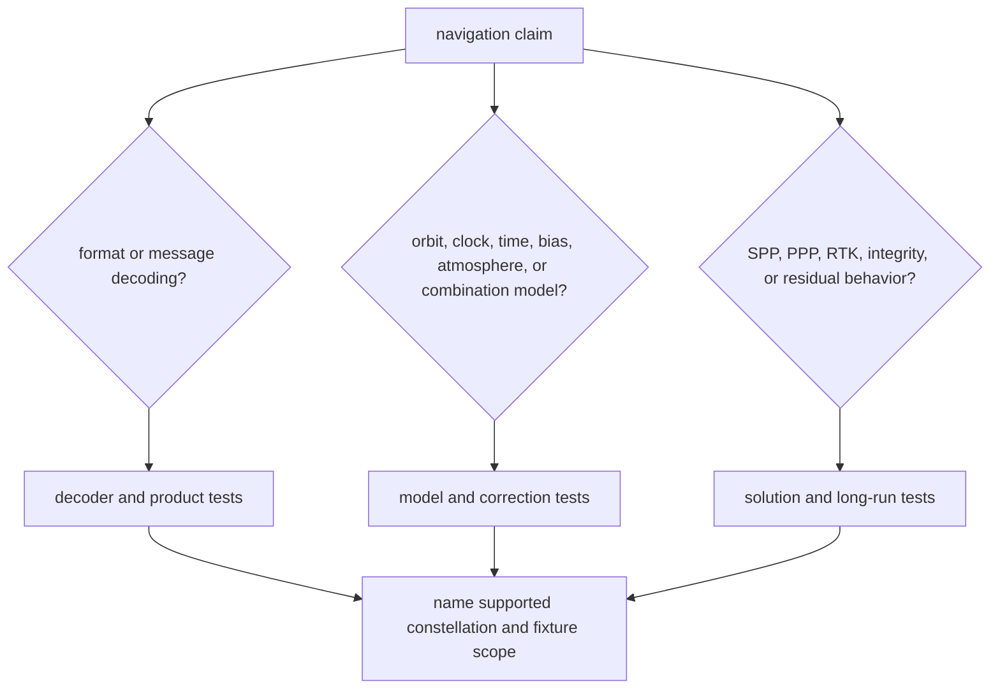

# Known Limitations

`bijux-gnss-nav` owns scientific navigation behavior, not every condition under
which a full receiver run may succeed. The crate has broad proof, but each
proof family defends a specific claim: parsing, orbit/clock state, correction
models, SPP, PPP, RTK, integrity, or public-data comparability.

## Limits Readers Should Know

| limitation | consequence | honest reading |
| --- | --- | --- |
| Navigation proof is model-specific. | Passing a GPS broadcast orbit test does not prove Galileo, BeiDou, GLONASS, SP3, CLK, PPP, or RTK behavior. | Name the constellation, product type, correction, and estimator family in the claim. |
| Public-data fixtures are bounded. | Public references prove comparability for selected scenarios, not every station, epoch, geometry, or atmospheric state. | Treat station-truth and public-data tests as evidence, not universal certification. |
| Estimator families interact but remain distinct. | A correction or weighting change can alter SPP, PPP, RTK, integrity, and residual behavior differently. | Run the estimator family that consumes the changed model. |
| Parser correctness is not solution correctness. | Decoding a navigation message or product does not prove the final position solution is accurate. | Pair parser proof with orbit, clock, correction, or solution proof when the claim reaches those surfaces. |
| Local math helpers are domain-owned, not generic utilities. | Matrix, weighting, and model helpers can become attractive to other crates for the wrong reason. | Keep them private or nav-scoped unless they represent shared GNSS meaning. |

## Claim Routing

## First Proof Route

Start with `crates/bijux-gnss-nav/docs/TESTS.md`, then select the proof by the
reader-facing claim:

- format and product parsing:
  `integration_precise_products.rs`, `integration_sp3_products.rs`, or the
  constellation-specific navigation decode test
- orbit, clock, time, and correction behavior:
  `integration_broadcast_orbit_accuracy.rs`,
  `integration_clk_reference_accuracy.rs`, or the relevant ionosphere,
  troposphere, bias, or time-system test
- positioning and integrity:
  `integration_position.rs`, `integration_position_protection_levels.rs`, and
  the RAIM tests that match the claim
- PPP and RTK:
  `integration_public_ppp_convergence.rs`,
  `integration_rtk_baseline_accuracy.rs`, and the related ambiguity or
  differencing test
- cross-run confidence:
  `long_run_stability.rs` plus the focused family test above

If a document claims more than the selected proof can defend, narrow the claim
or add the missing nav-owner evidence before publishing it.
