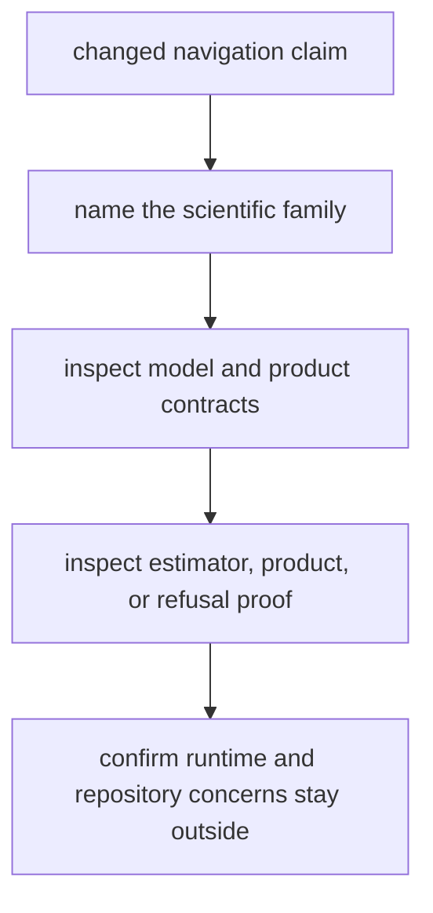

# Review Checklist

Review `bijux-gnss-nav` as the owner of reusable navigation science:
products, time models, orbit and clock interpretation, correction laws,
estimation, refusal behavior, and integrity evidence. The crate may consume
observations and signal facts, but it should not own receiver scheduling,
repository persistence, or command presentation.

## Review Gates

| changed surface | accept only when | inspect before accepting |
| --- | --- | --- |
| navigation product parser or provider | Product meaning is documented and reusable without repository-file policy. | [Format And Product Contracts](../interfaces/format-and-product-contracts.md), `crates/bijux-gnss-nav/docs/CONTRACTS.md` |
| orbit, clock, time, or model logic | Scientific assumptions and units are explicit enough for downstream callers. | [Orbit Contracts](../interfaces/orbit-contracts.md), [Time And Model Contracts](../interfaces/time-and-model-contracts.md) |
| correction law | The correction remains a reusable navigation surface, not receiver tuning. | [Correction Contracts](../interfaces/correction-contracts.md), `crates/bijux-gnss-nav/tests/integration_precise_correction_queries.rs` |
| estimator or positioning behavior | Refusal, downgrade, residual, and integrity outcomes are backed by targeted tests. | [Estimation Contracts](../interfaces/estimation-contracts.md), `crates/bijux-gnss-nav/docs/ESTIMATION.md` |
| public export | The export represents durable navigation science rather than a caller shortcut. | [API Surface](../interfaces/api-surface.md), `crates/bijux-gnss-nav/docs/PUBLIC_API.md`, `crates/bijux-gnss-nav/tests/integration_guardrails.rs` |

## Blocking Signs

- A solver accepts impossible geometry, missing reference coordinates, or weak
  residual evidence without a documented refusal or downgrade path.
- A product parser explains file handling but not the scientific meaning of the
  parsed state.
- A runtime convenience becomes a navigation API even though it only makes one
  receiver flow easier.
- A reference fixture changes without explaining why the new expectation is
  scientifically stronger or more representative.

## Evidence To Require

- Read `crates/bijux-gnss-nav/docs/TESTS.md`,
  `crates/bijux-gnss-nav/docs/ESTIMATION.md`, and
  `crates/bijux-gnss-nav/docs/PUBLIC_API.md` before accepting broad changes.
- Require the narrow test family that matches the changed scientific claim:
  product, orbit, correction, estimator, integrity, or refusal behavior.
- Update interface docs when public navigation meaning changes.
- Route command rendering, receiver scheduling, and persisted-evidence layout
  back to their owning crates instead of expanding nav to host them.
