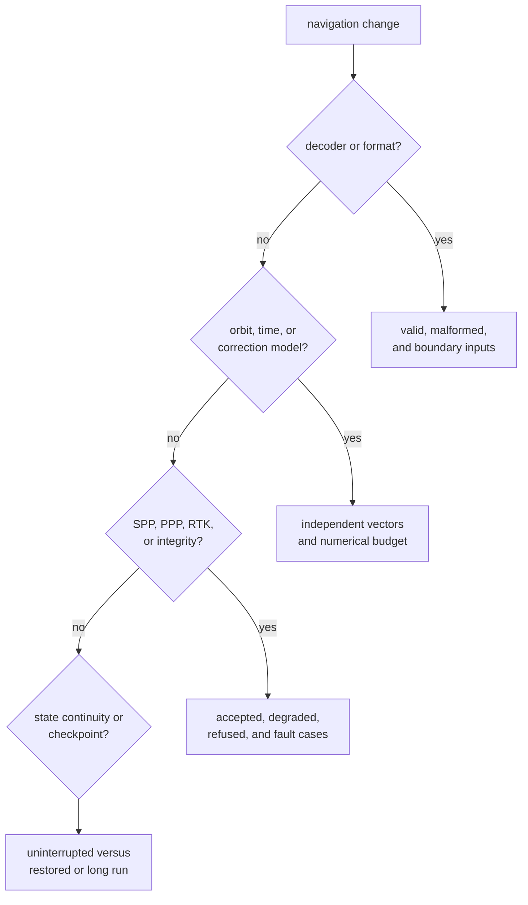
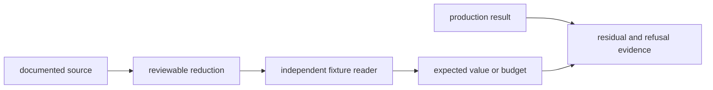

# Navigation Test Evidence

Navigation tests must connect a scientific claim to an independent reference,
an explicit budget, or a refusal invariant. A parser round trip cannot prove an
orbit model, and one solved position cannot prove integrity, convergence, or
uncertainty.

## Select Evidence By Claim



Use the narrowest target that proves the moved claim, then add adjacent evidence
only when the contract crosses a real boundary.

## Current Evidence Families

| Claim family | Representative evidence | Limits |
| --- | --- | --- |
| broadcast decoders | [BeiDou decode](../../../crates/bijux-gnss-nav/tests/integration_beidou_navigation_decode.rs), [GLONASS decode](../../../crates/bijux-gnss-nav/tests/integration_glonass_navigation_decode.rs), and the [LNAV golden fixture](../../../crates/bijux-gnss-nav/tests/golden_lnav_fixture.rs) | representative messages and fixtures, not every valid or malformed frame |
| RINEX and observation channels | [RINEX channel coverage](../../../crates/bijux-gnss-nav/tests/integration_rinex_observation_channels.rs) and constellation-specific observation tests | checked-in files and supported mappings only |
| broadcast orbit and clocks | [broadcast orbit reference](../../../crates/bijux-gnss-nav/tests/integration_broadcast_orbit_reference.rs), [accuracy budget](../../../crates/bijux-gnss-nav/tests/integration_broadcast_orbit_accuracy_budget.rs), and [clock reference](../../../crates/bijux-gnss-nav/tests/integration_broadcast_clock_reference.rs) | selected satellites, epochs, and declared tolerances |
| precise products | [SP3 reference accuracy](../../../crates/bijux-gnss-nav/tests/integration_sp3_reference_accuracy.rs), [CLK reference accuracy](../../../crates/bijux-gnss-nav/tests/integration_clk_reference_accuracy.rs), and [precise-product queries](../../../crates/bijux-gnss-nav/tests/integration_precise_correction_queries.rs) | reduced fixtures and feature-dependent behavior |
| time systems | [constellation time conversions](../../../crates/bijux-gnss-nav/tests/integration_time_system_conversions.rs) and [UTC leap seconds](../../../crates/bijux-gnss-nav/tests/integration_utc_leap_seconds.rs) | selected boundaries, not an exhaustive historical time corpus |
| corrections and combinations | [measured ionosphere](../../../crates/bijux-gnss-nav/tests/integration_measured_ionosphere.rs), [ionosphere-free code](../../../crates/bijux-gnss-nav/tests/integration_iono_free_code.rs), and [bias corrections](../../../crates/bijux-gnss-nav/tests/integration_bias_sinex_corrections.rs) | declared constellations, frequencies, and fixture assumptions |
| positioning and refusal | [position solution](../../../crates/bijux-gnss-nav/tests/integration_position.rs), [protection levels](../../../crates/bijux-gnss-nav/tests/integration_position_protection_levels.rs), and [position refusal](../../../crates/bijux-gnss-nav/tests/integration_position_refusal.rs) | scenario-specific geometry and error models |
| public-data SPP and PPP | [RTKLIB position comparison](../../../crates/bijux-gnss-nav/tests/integration_public_spp_rtklib_position.rs), [PPP convergence](../../../crates/bijux-gnss-nav/tests/integration_public_ppp_convergence.rs), and [station truth](../../../crates/bijux-gnss-nav/tests/integration_public_station_truth.rs) | one public station family and checked-in reductions |
| RTK and ambiguity | [ambiguity fixing](../../../crates/bijux-gnss-nav/tests/integration_rtk_ambiguity_fixing.rs), [baseline accuracy](../../../crates/bijux-gnss-nav/tests/integration_rtk_baseline_accuracy.rs), and [double differences](../../../crates/bijux-gnss-nav/tests/integration_rtk_double_difference.rs) | modeled baselines and declared bias evidence |
| faults and integrity | [fault injection](../../../crates/bijux-gnss-nav/tests/fault_injection.rs), [RAIM exclusion](../../../crates/bijux-gnss-nav/tests/integration_raim_fault_exclusion.rs), and [underdetermined refusal](../../../crates/bijux-gnss-nav/tests/integration_raim_underdetermined_refusal.rs) | injected fault classes, not all real receiver failure modes |
| continuity | [checkpoint behavior](../../../crates/bijux-gnss-nav/tests/integration_checkpoint.rs) and [long-run EKF stability](../../../crates/bijux-gnss-nav/tests/long_run_stability.rs) | EKF-focused integration evidence; PPP checkpoint coverage is source-local |

The [package test guide](../../../crates/bijux-gnss-nav/docs/TESTS.md) gives the
broader family map. It does not turn every checked-in file into independent
truth.

## Build A Credible Reference Chain



A reference-backed test should expose:

- source and licensing or redistribution basis
- exact satellite, epoch, signal, frame, and time system
- transformations applied to reduce the source
- units and tolerance derivation
- residuals or diagnostics on failure
- why the expected value is independent of the production path

If a helper calls the same model under test, it is setup reuse, not an oracle.

## Treat Generated Fixtures Carefully

The public PPP convergence target can rewrite its checked-in report when a
specific environment variable is set. Regeneration is a review action, not a
normal verification mode. When behavior intentionally changes:

1. run the calculation without regeneration and inspect the drift
2. explain the scientific reason and budget impact
3. regenerate only the owned fixture
4. review the full fixture diff
5. rerun without the regeneration variable

Never refresh expected output merely to make a changed implementation pass.

## Cover Claims And Refusals

Estimator evidence should include:

- a solvable case with an explicit accuracy or residual budget
- insufficient geometry or missing prerequisites
- malformed, stale, or inconsistent products
- outlier and fault behavior
- degraded versus refused outcomes
- uncertainty or protection behavior when claimed
- state reset, gap, or checkpoint continuity when relevant

Assert structured status and diagnostic evidence, not only `Some` versus
`None`.

## Use Focused Targets

Representative invocations from the repository root:

```console
cargo test -p bijux-gnss-nav --test integration_broadcast_orbit_reference
cargo test -p bijux-gnss-nav --test integration_position_refusal
cargo test -p bijux-gnss-nav --test integration_checkpoint
```

For precise-product changes, compare the default feature set with
`--no-default-features`. A default-feature pass alone does not prove the
fallback or refusal contract.

## Do Not Overstate A Green Target

- A format test does not prove estimator accuracy.
- A public-data comparison does not generalize beyond its station, epochs, and
  reduction.
- The long-run target covers EKF stability, not every PPP or RTK state.
- Checkpoint tests prove scientific restoration, not durable file persistence.
- Guardrails prove package policy, not numerical validity.
- A precise-product fixture does not prove all interpolation edges or gaps.

Record the target, fixture, budget, feature set, and residual coverage in the
verification note. Navigation evidence is credible when a reader can trace the
claim from source data or invariant to the exact assertion without trusting the
production implementation as its own reference.
