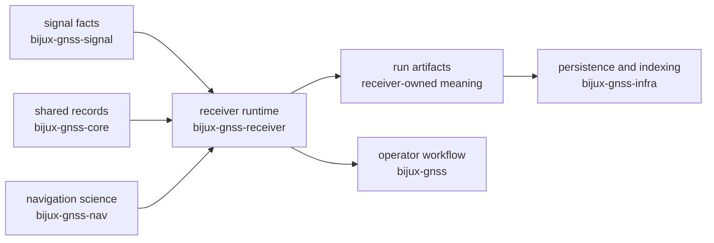

# Architecture Risks

`bijux-gnss-receiver` is where independent GNSS facts become a running
receiver. That makes it useful and dangerous: acquisition, tracking,
observation construction, optional navigation handoff, diagnostics, and runtime
artifacts all meet here. A change is risky when it makes those seams harder to
name or easier to bypass.

## Risk Map

The receiver should compose the graph. It should not rewrite the meaning owned
by the neighboring crates.

## Highest-Risk Changes

- the crate is broad enough that runtime convenience can slowly erase internal
  stage boundaries between acquisition, tracking, observations, navigation
  handoff, and reporting
- receiver-owned adapters over nav science can be mistaken for permission to
  own orbit, clock, estimator, or correction science
- runtime artifacts can attract repository semantics because they are later
  persisted by infrastructure
- synthetic helpers can sprawl into an informal truth system if not kept tied
  to receiver-boundary proof
- public re-exports can make lower-owner surfaces look receiver-owned when
  they are only being composed for caller convenience

## Review Triage

| change shape | risk to inspect | better destination when it is not receiver-owned |
| --- | --- | --- |
| new acquisition or tracking behavior | stage state leaks into signal catalogs or command policy | `bijux-gnss-signal` for reusable signal facts, `bijux-gnss` for operator selection |
| new observation or navigation handoff field | runtime record starts defining scientific model semantics | `bijux-gnss-core` for shared record meaning, `bijux-gnss-nav` for navigation science |
| new artifact field | runtime output starts naming directories, manifests, or repository history | `bijux-gnss-infra` |
| new simulation helper | synthetic data becomes the only proof instead of bounded receiver evidence | `bijux-gnss-receiver` tests plus explicit truth fixture limits |
| new public export | facade exposes a shortcut that callers will treat as a contract | `api.rs` only after the owner and stability promise are clear |

## Proof To Request

- `crates/bijux-gnss-receiver/docs/PIPELINE.md` when the change moves a stage
  boundary or handoff.
- `crates/bijux-gnss-receiver/docs/ARTIFACTS.md` when the change changes what a
  receiver run emits.
- `crates/bijux-gnss-receiver/docs/REFERENCE_VALIDATION.md` when the change
  compares runtime output to truth or reference trajectories.
- `crates/bijux-gnss-receiver/docs/BOUNDARY.md` when the ownership answer is
  not obvious from the diff.

Reject a receiver architecture change that can only be justified as "the
runtime already has access to that data." Access is not ownership.
