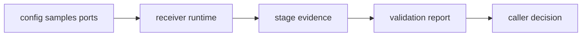

# Error Model

Receiver runtime has more than one honest failure mode, and the architecture
should keep them distinct.

## Failure Flow

## Failure Families

| family | meaning | correct response |
| --- | --- | --- |
| source or sample errors | data could not enter the runtime boundary correctly | fix input, metadata, clock, or source implementation |
| configuration failures | execution could not start with the supplied profile | fix schema, derived config, or incompatible options |
| acquisition refusal | signal evidence did not satisfy acquisition criteria | report no candidate or degraded evidence, not IO failure |
| tracking refusal or loss | lock, phase, or uncertainty evidence was insufficient | preserve lifecycle and transition evidence |
| observation construction failure | runtime could not produce coherent observation records | report rejected measurements with cause |
| feature unavailability | nav-dependent behavior was requested without enabled support | report unsupported feature boundary |
| validation degradation | produced output exists but fails truth, consistency, or budget checks | keep the evidence and report degraded trust |

## Review Rules

- Do not collapse weak scientific evidence into generic runtime failure.
- Do not treat malformed input the same as an unsupported feature.
- Preserve stage-local refusal evidence so artifacts remain inspectable.
- Keep repository-facing artifact inspection in infra after receiver evidence
  has been persisted.
- Keep command report wording honest about whether a run failed, degraded, or
  completed with rejected measurements.

## First Proof Check

Inspect `crates/bijux-gnss-receiver/src/engine/receiver_config.rs`,
`crates/bijux-gnss-receiver/src/io/data.rs`,
`crates/bijux-gnss-receiver/src/reference_validation.rs`,
`crates/bijux-gnss-receiver/src/validation_report.rs`,
`crates/bijux-gnss-receiver/docs/RUNTIME.md`, and
`crates/bijux-gnss-receiver/docs/REFERENCE_VALIDATION.md`.
