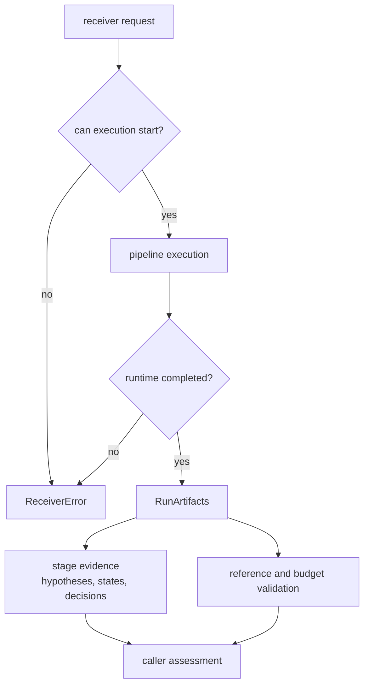
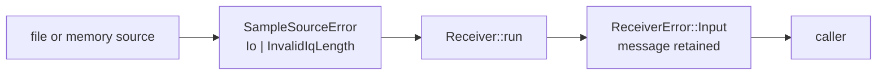
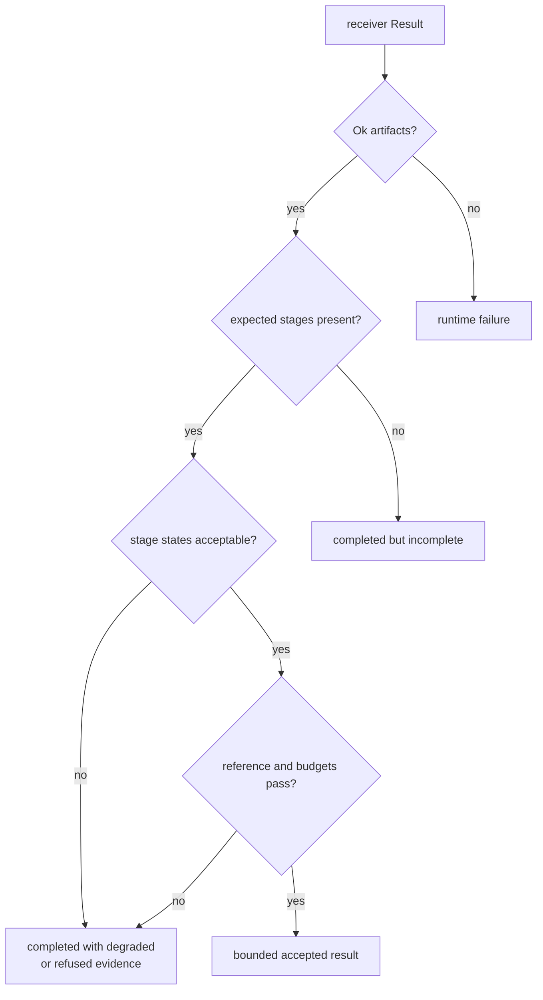

# Receiver Failure and Outcome Model

A receiver run can fail to execute, complete without usable evidence, reject one
satellite, lose one channel, refuse one observation epoch, or produce output
that later misses an accuracy budget. Those outcomes are not interchangeable.
Callers must inspect the narrowest record that owns the decision instead of
reducing every unfavorable result to a generic error string.

## Four Outcome Layers

| Layer | Representation | Meaning |
| --- | --- | --- |
| invocation/runtime failure | `Err(ReceiverError)` | the pipeline could not continue because input or executable configuration failed |
| completed run | `Ok(RunArtifacts)` | orchestration reached completion; no scientific success is implied |
| stage outcome | acquisition hypotheses, tracking state, observation status/decision, navigation status | one scientific or lifecycle decision was accepted, degraded, deferred, rejected, lost, or refused |
| validation outcome | consistency, convergence, truth-error, and budget reports | produced evidence exists, but its accuracy or internal consistency may be acceptable or unacceptable |

The `Result` boundary answers “did orchestration complete?” It does not answer
“did acquisition lock?”, “are observations usable?”, or “is the position
accurate?”

## Top-Level Error Boundary

`ReceiverError` exposes six categories:

| Variant | Intended category |
| --- | --- |
| `Input` | invalid or unreadable input |
| `Config` | invalid executable configuration |
| `Signal` | signal-processing contract failure |
| `Acquisition` | acquisition execution failure |
| `Tracking` | tracking execution failure |
| `Navigation` | navigation execution failure |

The current top-level engine explicitly emits `Input` when a sample source
fails and `Config` when front-end filter construction fails. The other variants
are part of the public taxonomy, but their presence is not evidence that every
stage currently propagates through them. Many weak or unsupported stage cases
are intentionally represented as artifacts instead.

Core’s `InputError`, `ConfigError`, `SignalError`, `AcqError`, `TrackError`, and
`NavError` wrappers each carry only a human-readable `message`. They are typed
by category but do not carry a stable diagnostic code or structured context.
Callers can match the `ReceiverError` variant; they should not parse message
text as a durable protocol.

### Source errors lose detail at the engine boundary

`SampleSourceError` distinguishes operating-system I/O failure from an
incomplete interleaved-IQ sample. When `Receiver::run` encounters either during
streaming, it records a diagnostic dump and converts the failure to
`ReceiverError::Input(InputError { message })`. The original source variant is
not retained. Code that needs to distinguish file-open or framing failures
should do so while constructing or directly using the sample source, before the
receiver-level conversion.

This flattening is a current limitation. Adding machine-readable source cause
to the receiver error would be an API change and should preserve existing
category matching while avoiding message parsing.

## Configuration Failure

`ReceiverConfig` has a validation report that can collect multiple field
errors. Conversion to `ReceiverPipelineConfig` is separate and infallible, and
`Receiver::new` accepts the derived configuration without validating it.
Callers are therefore responsible for validating the on-disk configuration
before constructing the runtime.

Front-end filter design is checked again when the run begins because it depends
on executable sample-rate and filter values. Failure there becomes
`ReceiverError::Config`.

Do not convert a configuration report containing several actionable errors
into only the first message unless the calling interface explicitly documents
that loss.

## Empty Input Is a Completed Empty Run

If the first source read returns end-of-stream, the current engine returns
`Ok(RunArtifacts::default())`. It does not return `Input`, `Acquisition`, or a
special empty-input error. This means callers that require evidence must check
processed sample counts and expected artifact families rather than relying on
`Result::is_ok()`.

An I/O or framing error during the first or later read is different: it returns
`ReceiverError::Input`. End-of-stream is normal source completion; malformed
streaming input is a runtime failure.

## Acquisition Outcomes

Acquisition communicates signal evidence through `AcqHypothesis`:

| Hypothesis | Meaning in the current pipeline | Tracking consequence |
| --- | --- | --- |
| `Accepted` | ratio and policy evidence supports the candidate | eligible and preferred for tracking |
| `Ambiguous` | candidate is plausible but competing evidence remains | eligible for tracking with degraded initial state |
| `Rejected` | evidence does not satisfy acceptance or is physically rejected | not promoted as a tracking candidate |
| `Deferred` | decision cannot be made with available frame, integration support, or model information | not promoted until adequate evidence exists |

Insufficient samples produce a deferred candidate with required and available
sample context. Zero-signal input produces a rejected candidate. Some signal
model errors, including a missing GLONASS frequency channel, are converted into
deferred candidates with an explanation reason rather than aborting the run.

This is deliberate evidence preservation: an unsupported request can coexist
with usable requests in the same run. The explanation string currently carries
the reason, however, so callers should prefer typed hypothesis and structured
fields and treat reason-string parsing as unstable.

## Tracking Outcomes

Tracking failure is channel-local unless execution itself cannot continue.
Per-channel reports distinguish:

- acquired and pull-in states before stable lock
- locked state with current loop and uncertainty evidence
- degraded state when evidence weakens but continued tracking remains possible
- lost state when lock cannot be maintained
- reacquired marker after recovery
- refused state for a channel below the tracking C/N0 floor

`TrackTransition`, `TrackEpoch`, and `TrackingChannelStateReport` preserve the
sample index, epoch, final state, and available reason. A short fade, cycle
slip, sample-rate mismatch, or low C/N0 should change channel evidence; it
should not be disguised as an I/O error.

An acquisition with `Ambiguous` hypothesis starts tracking as degraded, not as
fully accepted. Consumers must not infer initial confidence merely because the
candidate was eligible for tracking.

## Observation Outcomes

Observation construction preserves per-satellite and per-epoch decisions.

| Condition | Satellite status | Epoch effect |
| --- | --- | --- |
| stable lock and adequate C/N0 | `Accepted` | can support an accepted epoch |
| C/N0 below the observation floor | `Weak` | retained with degraded support |
| tracking unlocked | `Missing` | not an accepted observable |
| sample-rate mismatch, non-finite value, or physical inconsistency | `Inconsistent` | epoch is rejected |
| explicit typed rejection | `Rejected` | not accepted; the current status classifier does not assign this variant |

An epoch is rejected when any satellite is inconsistent, when no accepted
observable remains, or when signal-layer epoch validation fails. The
`decision_reason` and satellite rejection reasons must travel with the record.
Removing rejected measurements from output would erase why navigation did not
receive them.

## Navigation Non-Execution and Refusal

Navigation availability has three distinct cases in the top-level engine:

- without the `nav` feature, the stage records `disabled` and returns no
  navigation epochs
- with the feature but without capture start time, the stage records
  `missing_capture_start_gps_time` and returns no navigation epochs
- with the feature but without ephemerides, the stage records
  `missing_navigation_data` and returns no navigation epochs

None of these currently becomes `ReceiverError::Navigation`. They are completed
runs with navigation non-execution. When navigation does execute, each
`NavSolutionEpoch` carries its own status, validity, lifecycle, refusal,
integrity, residual, and uncertainty evidence.

An empty navigation vector is therefore ambiguous without build features,
runtime trace, source capabilities, and observation context. A caller that
requires a position must assert those prerequisites and an acceptable solution
status explicitly.

## Validation Is Not Execution

Reference comparison and validation reports operate on artifacts after they
exist. They can report:

- no matched reference epochs
- timing inconsistency
- excessive position, velocity, clock, residual, or convergence error
- insufficient stable-window coverage
- a failed budget despite a completed receiver run

Keep failed validation evidence. Deleting output or rewriting the run as an I/O
failure makes the defect harder to diagnose and falsely describes what
happened.

## Translation Rules

- Preserve the originating category and source when an error crosses a package
  boundary; add context rather than replacing it.
- Use typed stage states for expected scientific refusal, ambiguity, weak
  evidence, and loss of lock.
- Use top-level errors when execution cannot safely continue.
- Keep diagnostic code, severity, stage, satellite/signal identity, sample or
  epoch position, and threshold evidence where the contract provides them.
- Never infer success from a non-empty vector alone; inspect status and
  validity.
- Never infer failure from an empty navigation vector alone; inspect feature,
  prerequisites, trace, and observation evidence.
- Do not parse free-form error or reason text when a typed field exists.
- Do not convert validation failure into source, configuration, or runtime
  failure.

## Evidence and Current Gaps

- [Receiver error wrapper](../../../crates/bijux-gnss-receiver/src/engine/receiver_config.rs)
  defines the public top-level categories.
- [Sample source boundary](../../../crates/bijux-gnss-receiver/src/io/data.rs)
  defines I/O and IQ-framing errors.
- [Receiver engine](../../../crates/bijux-gnss-receiver/src/engine/engine.rs)
  defines empty-input, stage orchestration, feature, and error translation
  behavior.
- [Acquisition failure evidence](../../../crates/bijux-gnss-receiver/src/pipeline/acquisition/candidate_failures.rs)
  builds rejected and deferred candidates instead of aborting mixed requests.
- [Observation status policy](../../../crates/bijux-gnss-receiver/src/pipeline/observations/status.rs)
  defines weak, missing, inconsistent, and accepted measurements.
- [Reference validation contract](../../../crates/bijux-gnss-receiver/docs/REFERENCE_VALIDATION.md)
  separates runtime completion from truth comparison.

The current model has real limitations: top-level core error categories contain
only messages; source variants are flattened during engine execution; several
`ReceiverError` variants are not the engine’s current path for stage-local
outcomes; empty input is successful; and navigation non-execution is represented
by trace plus empty output. Callers must account for those facts until stronger
typed contracts replace them.
