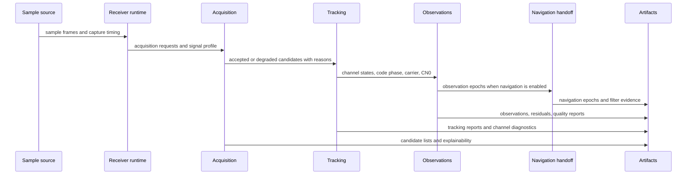

# Execution Model

The receiver execution model is a staged evidence pipeline. Each stage consumes
typed state from the previous stage and emits enough diagnostics for the next
stage, reports, and validation tests to explain what happened.

## Stage Flow

## Execution Ownership

| stage | receiver-owned decision | not owned here |
| --- | --- | --- |
| runtime setup | assemble config, ports, sinks, support inventory, capture timing | command UX and persisted run layout |
| acquisition | choose requests, search windows, ranking, ambiguity state, candidate reports | signal-code definitions and reusable DSP primitives |
| tracking | maintain channel lifecycle, lock evidence, loop state, reacquisition, fade handling | generic loop math outside receiver context |
| observations | turn tracking state into observation epochs with residual and quality evidence | cross-crate field meaning owned by core |
| navigation handoff | call navigation solvers or filters from receiver config and observations | standalone orbit, correction, PPP, RTK, or estimator science |
| validation | compare receiver outputs to reference truth at receiver boundary | repository artifact inspection and persisted manifest policy |

## State Handoff Rules

- A stage may enrich evidence; it must not silently reinterpret the previous
  stage's status.
- Degraded acquisition or tracking state must stay visible long enough for
  downstream artifacts and reports to explain it.
- Runtime sinks record events, traces, and metrics; they do not own the
  scientific meaning of the values they observe.
- Optional navigation is a receiver execution branch, not a transfer of
  navigation-domain ownership into the receiver crate.

## First Proof Check

Use `crates/bijux-gnss-receiver/src/pipeline/mod.rs` to find the stage owner,
then inspect the specific stage module and its integration tests. For runtime
composition, start with `crates/bijux-gnss-receiver/src/engine/receiver.rs`,
`crates/bijux-gnss-receiver/src/engine/engine.rs`, and
`crates/bijux-gnss-receiver/src/engine/runtime.rs`.
