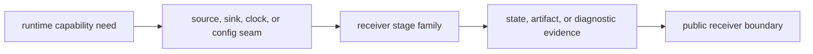

# Extensibility Model

Extending `bijux-gnss-receiver` should mean adding or deepening a real runtime
family, not bolting convenience glue onto the public surface.

## Runtime Extension Flow

## Legitimate Extension Paths

- add a new runtime configuration or diagnostics surface inside `engine/`
- deepen an existing stage family inside acquisition, tracking, observations,
  or receiver-owned navigation adapters
- add a new runtime seam for samples, artifacts, or timing
- add synthetic proof or validation helpers that exercise the receiver boundary

## Illegitimate Extension Paths

- adding command-specific wrappers directly to `api.rs`
- adding repository file-layout policy into runtime artifacts
- re-exporting lower-level science only because one caller wants a shorter path

## Decision Table

| proposed extension | receiver-owned when | route elsewhere when |
| --- | --- | --- |
| acquisition or tracking behavior | it changes runtime channel state or emitted evidence | it is reusable signal math |
| artifact payload | it describes receiver execution, stage status, or diagnostics | it describes repository layout or manifest policy |
| synthetic helper | it exercises receiver runtime under controlled inputs | it creates independent truth for many crates |
| public API addition | multiple callers need stable receiver behavior | it is only a command convenience |

## Review Checks

- Can the new surface be named by a durable runtime responsibility?
- Does the extension keep signal and navigation science in their owning crates?
- Is the observable evidence covered by tests or artifacts?
