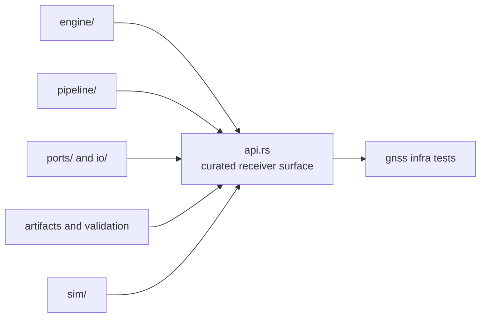

# Architecture

Open this section when the question is structural: where engine, pipeline,
ports, artifacts, validation, and simulation live in code, and how the crate
stays broad without becoming a shapeless runtime bucket.

## Structural Shape

## Read These First

- open [Foundation](../foundation/) first if the real dispute is still about
  ownership rather than structure
- stay in this section when the question is where a runtime family belongs in
  code and which dependency direction is legitimate

## First Proof Check

- `crates/bijux-gnss-receiver/src/lib.rs`
- `crates/bijux-gnss-receiver/src/api.rs`
- `crates/bijux-gnss-receiver/docs/ARCHITECTURE.md`
