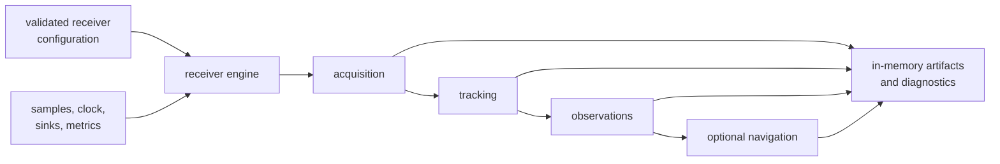
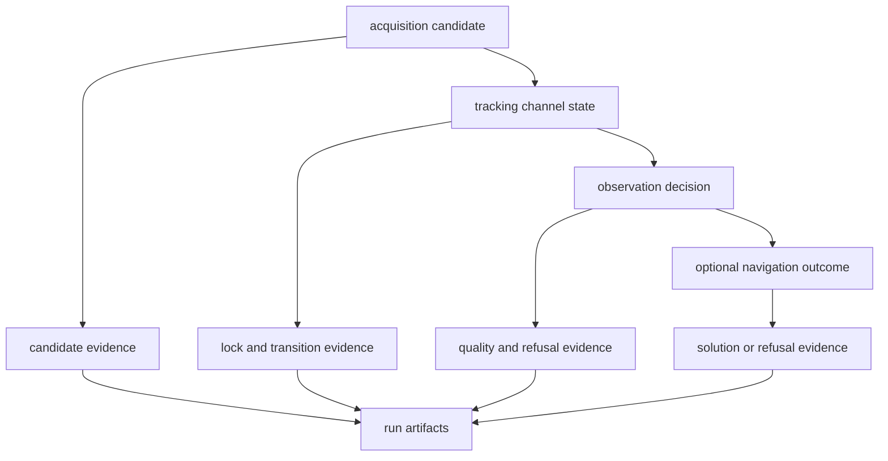

# Receiver Architecture Guide

`bijux-gnss-receiver` owns staged runtime execution. The engine validates
configuration and composes effects; acquisition, tracking, observations, and
optional navigation adapters exchange typed state; artifacts and diagnostics
record what happened without choosing repository placement.

## Runtime Structure

Every stage may enrich evidence, but no stage may erase uncertainty, ambiguity,
degradation, or refusal from the stage before it.

## Locate The Runtime Owner

| concern | architecture route | ownership rule |
| --- | --- | --- |
| Configuration, defaults, validation, runtime effects, support, or top-level composition | [Module map](module-map.md) | engine code owns receiver policy, not command defaults |
| Acquisition, tracking, observations, or optional navigation order | [Execution model](execution-model.md) | pipeline stages own handoff and lifecycle evidence |
| Samples, clocks, artifacts, metrics, tracing, or logs | [Integration seams](integration-seams.md) | effects cross explicit ports rather than hidden globals |
| Dependency on core, signal, navigation, infrastructure, or command | [Dependency direction](dependency-direction.md) | receiver composes lower science and is consumed by higher repository layers |
| Channel state, filter state, artifacts, or persisted runs | [State and persistence](state-and-persistence.md) | receiver owns in-memory runtime state; infrastructure owns durable placement |
| Input, acquisition, tracking, observation, or navigation failure | [Error model](error-model.md) | failure remains attributable to the earliest failing boundary |
| New stage, adapter, port, or artifact family | [Extensibility model](extensibility-model.md) | additions require durable runtime responsibility and evidence |
| Cross-stage coupling or imported repository policy | [Architecture risks](architecture-risks.md) | convenience must not blur scientific or persistence ownership |

## State Moves Forward, Evidence Fans Out

The runtime path and evidence path are related but not identical. A rejected
candidate may never become a channel yet still belongs in acquisition evidence.
A refused observation may stop navigation input yet remain essential to
diagnosis.

## Effects Are Replaceable

Stage math must not open repository files, choose run directories, read
wall-clock time implicitly, or render command reports. Samples and time enter
through owned seams; artifacts, diagnostics, metrics, traces, and logs leave
through explicit runtime boundaries. Tests can replace those effects without
changing stage semantics.

## Optional Navigation Is An Adapter

The receiver decides when observations are ready for a navigation call and how
the resulting evidence joins a run. Navigation owns orbit, correction,
estimation, integrity, PPP, and RTK science. Feature-gating the adapter must not
change ownership or semantics of acquisition, tracking, or observations.

## Implementation Evidence

Use [code navigation](code-navigation.md) after identifying the concern. The
implementation authorities are the
[receiver engine](../../../crates/bijux-gnss-receiver/src/engine/mod.rs),
[pipeline boundary](../../../crates/bijux-gnss-receiver/src/pipeline/mod.rs),
[runtime ports](../../../crates/bijux-gnss-receiver/src/ports/mod.rs),
[sample adapters](../../../crates/bijux-gnss-receiver/src/io/mod.rs),
[artifact model](../../../crates/bijux-gnss-receiver/src/artifacts.rs), and
[simulation boundary](../../../crates/bijux-gnss-receiver/src/sim/mod.rs).

The [crate architecture](../../../crates/bijux-gnss-receiver/docs/ARCHITECTURE.md)
defines the complete runtime dataflow and dependency boundary.
