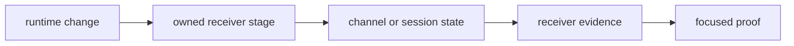

# Change Principles

Changes to `bijux-gnss-receiver` should preserve runtime legibility, not only
make the tests pass.

## Change Flow

## Principles

- keep runtime composition near the families that own it instead of building a
  giant convenience layer
- let signal and navigation crates own their science even when the runtime
  consumes it heavily
- treat artifacts, traces, and validation helpers as receiver-boundary
  contracts, not as persistence policy
- widen the public receiver API only when multiple downstream owners genuinely
  need a stable runtime contract
- keep synthetic helpers honest about exercising receiver behavior rather than
  replacing lower-level truth ownership

## Reader Impact

| reader | needs to know |
| --- | --- |
| receiver maintainer | which stage owns the state or diagnostic change |
| CLI maintainer | which API or artifact can be called without reaching into internals |
| signal/nav owner | whether their science contract changed or only receiver use changed |
| evidence reviewer | which artifact, trace, or report proves the runtime claim |

## Warning Signs

- a new helper is easier to describe by one caller than by its runtime role
- receiver configuration starts embedding command defaults or report wording
- runtime artifacts start depending on repository path or manifest assumptions

## Review Checks

- Does the change name the receiver stage it changes?
- Are lock, carrier, code, observation, or refusal effects visible to readers?
- Is persistence delegated to infra and scientific truth delegated to signal,
  nav, or testkit?
