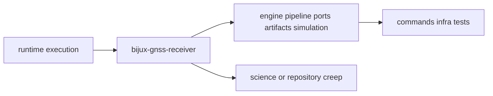

# Foundation

Open this section when the question is why `bijux-gnss-receiver` owns runtime
orchestration before command, repository, signal, or navigation layers start
pulling the answer toward convenience.

## Boundary Model

The receiver boundary is only trustworthy when readers can see where stage
composition stops and where lower scientific owners or higher repository owners
must take over.

## Read These First

- open [Ownership Boundary](ownership-boundary.md) first when a feature feels
  adjacent to `signal`, `nav`, `infra`, or `gnss`
- open [Package Overview](package-overview.md) when you need the shortest
  durable description of the crate role
- open [Scope And Non-Goals](scope-and-non-goals.md) when the question is what
  receiver runtime should explicitly refuse

## The Mistake This Section Prevents

The most common mistake here is assuming that the runtime crate should own any
logic that happens to run during a receiver session. This section keeps runtime
composition, signal science, navigation science, and repository persistence
from collapsing into one owner.

## Pages In This Section

- [Package Overview](package-overview.md)
- [Scope And Non-Goals](scope-and-non-goals.md)
- [Ownership Boundary](ownership-boundary.md)
- [Repository Fit](repository-fit.md)
- [Domain Language](domain-language.md)
- [Dependencies And Adjacencies](dependencies-and-adjacencies.md)
- [Change Principles](change-principles.md)

## First Proof Check

- `crates/bijux-gnss-receiver/README.md`
- `crates/bijux-gnss-receiver/docs/BOUNDARY.md`
- `crates/bijux-gnss-receiver/src/engine/`
- `crates/bijux-gnss-receiver/src/pipeline/`
- `crates/bijux-gnss-receiver/src/ports/`

## Leave This Section When

- leave for [Interfaces](../interfaces/) when the dispute is already about a
  public runtime, stage, or port contract
- leave for [Architecture](../architecture/) when the ownership question is
  settled and the next question is where the code lives
- leave for [Quality](../quality/) when the boundary is clear and the question
  becomes whether the trust story is honest enough
