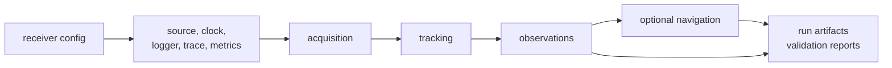

# Package Overview

`bijux-gnss-receiver` owns receiver runtime execution: configuration becomes a
running receiver, sample frames enter through ports, stages produce evidence,
and runtime artifacts leave the crate before repository persistence takes over.

This crate is large because the receiver boundary is large. Acquisition,
tracking, observations, optional navigation handoff, runtime sinks, simulation,
and receiver-side validation must agree on one execution story.

## Runtime Chain

## Owned Families

| family | owns | first proof |
| --- | --- | --- |
| engine | runtime config, validation, defaults, logging, metrics, support matrix, receiver composition | engine source |
| ports and I/O | sample sources, artifact sinks, clocks, runtime effect seams | port and I/O source |
| acquisition | request planning, search windows, candidates, ranking, explainability, handoff evidence | acquisition stage source |
| tracking | channel lifecycle, lock evidence, loop state, reacquisition, sample-rate diagnostics | tracking stage source |
| observations | pseudorange, carrier phase, smoothing, residuals, quality, epoch manifests | observation stage source |
| navigation handoff | receiver-owned calls into navigation solving and filtering when enabled | navigation handoff source |
| simulation | synthetic sources, truth, stage accuracy, scenario validation | simulation source |
| validation reports | receiver-side accuracy, consistency, covariance, and reference checks | validation-report source |

## Reader Rules

- Use this handbook for execution order, state handoff, runtime diagnostics,
  and in-memory receiver artifacts.
- Leave for `bijux-gnss-signal` when the question is reusable code generation,
  signal catalog truth, sample math, front-end filtering, NCO behavior, or DSP
  discriminators outside one receiver run.
- Leave for `bijux-gnss-nav` when the question is navigation science rather
  than receiver-side invocation of that science.
- Leave for `bijux-gnss-infra` when runtime artifacts are named, persisted,
  indexed, compared across run directories, or tied to dataset registry state.
- Leave for `bijux-gnss-core` when the question is shared record meaning,
  observation fields, diagnostic codes, units, or artifact envelopes.

## Failure Reading

When a receiver test fails, first identify which stage emitted the wrong
evidence. Do not flatten every receiver failure into “pipeline”:

- acquisition failures usually involve signal model selection, code phase,
  Doppler search, candidate ranking, ambiguity, or explainability artifacts
- tracking failures usually involve lock state, loop bandwidth, Doppler ramp,
  reacquisition, fade handling, or channel diagnostics
- observation failures usually involve timestamping, pseudorange, carrier
  phase, smoothing, residuals, or quality classification
- navigation failures at this boundary usually involve receiver-to-nav handoff
  or filter configuration, not standalone navigation model law

## First Proof Check

Inspect the [receiver crate README](../../../crates/bijux-gnss-receiver/README.md),
[pipeline guide](../../../crates/bijux-gnss-receiver/docs/PIPELINE.md),
[runtime guide](../../../crates/bijux-gnss-receiver/docs/RUNTIME.md), and
[artifact guide](../../../crates/bijux-gnss-receiver/docs/ARTIFACTS.md). Then
inspect the relevant pipeline stage and the integration tests named in the
crate README.
