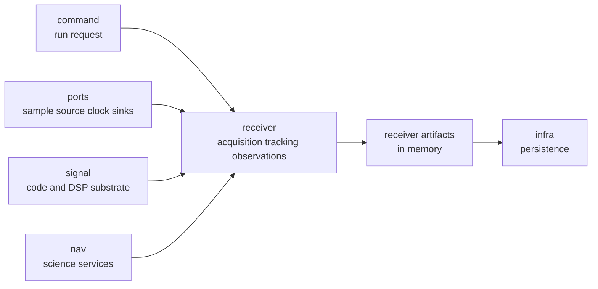

# Repository Fit

`bijux-gnss-receiver` is the runtime center of `bijux-telecom`. It turns
configured sample streams, signal facts, navigation services, ports, and stage
logic into receiver evidence. It does not own command syntax, persisted
repository layout, standalone signal math, or navigation science.

## Runtime Role

Receiver owns the moment separate stage computations become one run with
ordered evidence. That ownership includes runtime configuration, stage
composition, source/sink ports, diagnostics, and receiver-owned artifacts before
infra persists them.

## Fit To Defend

| neighbor | receiver consumes | receiver refuses |
| --- | --- | --- |
| command | run requests, selected config, report needs | CLI shape and operator report policy |
| infra | dataset-resolved inputs and persisted-output handoff | run directory layout, manifests, artifact indexing |
| signal | code, carrier, replica, and DSP substrate | reusable signal facts and spreading-code generation |
| nav | solvers, correction services, and navigation products when enabled | standalone estimation law and product parsing ownership |
| core | shared records, units, diagnostics, and artifact payload shapes | changing shared field meaning locally |

## Reader Questions

- Is the issue acquisition, tracking, observation construction, runtime ports,
  diagnostics, synthetic runtime proof, or receiver artifacts? Stay here.
- Is the issue command syntax or report routing? Leave for the [command guide](../../01-bijux-gnss/foundation/package-overview.md).
- Is the issue persisted run layout or dataset registry state? Leave for infra.
- Is the issue reusable code generation, signal identity, or DSP substrate?
  Leave for signal.
- Is the issue correction, orbit, estimator, PPP, RTK, or navigation format
  science? Leave for nav.

## First Proof Check

Start with the receiver [ownership boundary](../../../crates/bijux-gnss-receiver/docs/BOUNDARY.md),
[runtime model](../../../crates/bijux-gnss-receiver/docs/RUNTIME.md),
[pipeline guide](../../../crates/bijux-gnss-receiver/docs/PIPELINE.md), and
[artifact contract](../../../crates/bijux-gnss-receiver/docs/ARTIFACTS.md). Then
confirm the code path through the [engine source](../../../crates/bijux-gnss-receiver/src/engine/),
[pipeline source](../../../crates/bijux-gnss-receiver/src/pipeline/), and
[port source](../../../crates/bijux-gnss-receiver/src/ports/).
