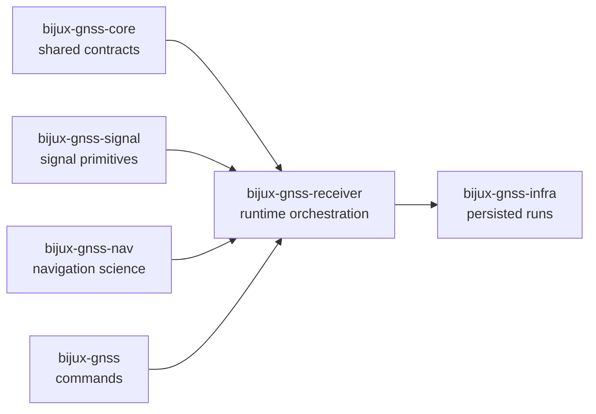

# bijux-gnss-receiver

`bijux-gnss-receiver` owns GNSS receiver runtime orchestration for
`bijux-telecom`. This is the crate where configuration becomes a concrete run,
where acquisition, tracking, observations, and optional navigation stages are
scheduled, and where receiver-boundary artifacts are emitted before
repository-side persistence takes over.

This package is the operational center of the product, but it should still
stay honest about what it does not own. It composes signal primitives,
navigation science, shared contracts, and infrastructure adapters. It should
not quietly absorb them.

## Why This Package Exists

- one crate must own the staged transition from source samples to receiver
  outputs
- runtime configuration, resource budgeting, ports, logging, and stage
  diagnostics should stay coherent instead of being split between command and
  science crates
- synthetic execution and receiver-boundary validation need an owner that can
  prove runtime behavior directly

## What It Owns

- receiver configuration and runtime state
- acquisition, tracking, observations, and optional navigation-stage
  execution
- receiver ports for clocks, sources, and sinks
- in-memory artifacts and receiver-boundary validation helpers
- synthetic receiver execution helpers exposed from the receiver surface

## What It Refuses

- command vocabulary and top-level operator policy owned by `bijux-gnss`
- persisted run layout, dataset history, and repository artifact inspection
  owned by `bijux-gnss-infra`
- reusable signal and DSP primitives owned by `bijux-gnss-signal`
- standalone navigation algorithms and correction families owned by
  `bijux-gnss-nav`
- shared IDs, time systems, units, and versioned envelope contracts owned by
  `bijux-gnss-core`

## Strongest Proof Surfaces

- crate README:
  [`crates/bijux-gnss-receiver/README.md`](../../crates/bijux-gnss-receiver/README.md)
- package docs:
  [`crates/bijux-gnss-receiver/docs/ARCHITECTURE.md`](../../crates/bijux-gnss-receiver/docs/ARCHITECTURE.md),
  [`crates/bijux-gnss-receiver/docs/PIPELINE.md`](../../crates/bijux-gnss-receiver/docs/PIPELINE.md),
  [`crates/bijux-gnss-receiver/docs/RUNTIME.md`](../../crates/bijux-gnss-receiver/docs/RUNTIME.md),
  [`crates/bijux-gnss-receiver/docs/SIMULATION.md`](../../crates/bijux-gnss-receiver/docs/SIMULATION.md)
- source roots:
  [`crates/bijux-gnss-receiver/src/engine`](../../crates/bijux-gnss-receiver/src/engine),
  [`crates/bijux-gnss-receiver/src/pipeline`](../../crates/bijux-gnss-receiver/src/pipeline),
  [`crates/bijux-gnss-receiver/src/ports`](../../crates/bijux-gnss-receiver/src/ports),
  [`crates/bijux-gnss-receiver/src/sim`](../../crates/bijux-gnss-receiver/src/sim)
- proof tests:
  [`crates/bijux-gnss-receiver/tests`](../../crates/bijux-gnss-receiver/tests)

## Start Here When

- the question is about how a receiver run is assembled or staged
- the issue is acquisition, tracking, observation, or navigation execution
  order
- the reader needs to understand runtime budgets, ports, or emitted receiver
  artifacts
- a validation report or synthetic receiver run needs to be traced to its
  owning boundary

## Reader Questions This Package Can Answer

- how runtime configuration becomes a staged receiver pipeline
- where acquisition, tracking, observations, and optional navigation are
  coordinated
- which artifacts are receiver-owned before infrastructure persists or inspects
  them
- how synthetic runtime helpers are meant to prove receiver behavior rather
  than replace lower-level owners

## Leave This Handbook When

- the question becomes about signal primitives or code families:
  [06-bijux-gnss-signal](../06-bijux-gnss-signal/)
- the question becomes about navigation estimators or precise products:
  [04-bijux-gnss-nav](../04-bijux-gnss-nav/)
- the question becomes about persisted run directories or dataset registries:
  [03-bijux-gnss-infra](../03-bijux-gnss-infra/)
- the question becomes about public commands or report wording:
  [01-bijux-gnss](../01-bijux-gnss/)
- the question becomes about shared observation or artifact contracts:
  [02-bijux-gnss-core](../02-bijux-gnss-core/)

## First Proof Check

- `crates/bijux-gnss-receiver/src/engine/`
- `crates/bijux-gnss-receiver/src/pipeline/`
- `crates/bijux-gnss-receiver/src/ports/`
- `crates/bijux-gnss-receiver/src/artifacts.rs`
- `crates/bijux-gnss-receiver/src/reference_validation.rs`
- `crates/bijux-gnss-receiver/src/sim/`
- `crates/bijux-gnss-receiver/docs/PIPELINE.md`
