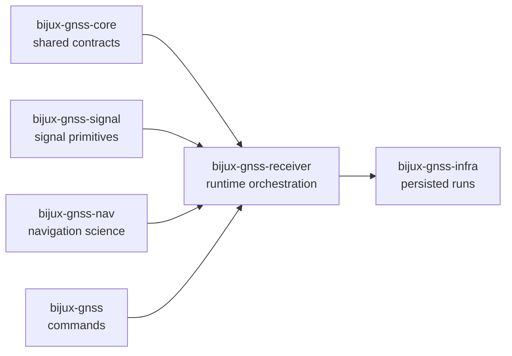

# bijux-gnss-receiver

`bijux-gnss-receiver` owns GNSS receiver runtime orchestration for
`bijux-telecom`. This crate is where configuration becomes a concrete run,
where acquisition, tracking, observation, and optional navigation stages are
scheduled, and where receiver-boundary artifacts are emitted before
repository-side persistence takes over.

This package is the operational center of the product, but it still has to be
strict about ownership. It composes signal primitives, navigation science,
shared contracts, and repository-facing neighbors. It should not quietly absorb
them.

## Read These First

- open [Foundation](foundation/) when the question is why receiver runtime owns
  this behavior at all
- open [Interfaces](interfaces/) when the issue is already about ports,
  artifacts, engine types, or stage-facing public contracts
- open [Architecture](architecture/) when the question is structural: where
  engine, pipeline, ports, artifacts, validation, and simulation live in code
- open [Quality](quality/) when ownership is clear and the question becomes
  whether the proof bar is strong enough

## Why This Package Exists

- one crate must own the staged transition from source samples to receiver
  outputs
- runtime configuration, resource budgeting, ports, logging, and stage
  diagnostics should stay coherent instead of being split between command and
  science crates
- synthetic execution and receiver-boundary validation need an owner that can
  prove runtime behavior directly

## What It Owns

- receiver configuration and runtime state
- acquisition, tracking, observations, and optional navigation-stage execution
- receiver ports for clocks, sample sources, and artifact sinks
- in-memory receiver artifacts and runtime-side validation helpers
- synthetic receiver execution helpers exposed from the receiver surface

The durable runtime families today are engine, pipeline stages, ports,
receiver-side validation, and synthetic proof. Readers should be routed into
one of those families quickly rather than treating the receiver crate as one
undifferentiated execution block.

## What It Refuses

- command vocabulary and top-level operator policy owned by `bijux-gnss`
- persisted run layout, dataset history, and repository artifact inspection
  owned by `bijux-gnss-infra`
- reusable signal and DSP primitives owned by `bijux-gnss-signal`
- standalone navigation algorithms, corrections, and estimators owned by
  `bijux-gnss-nav`
- shared IDs, time systems, units, and versioned envelope contracts owned by
  `bijux-gnss-core`

## Strongest Proof Surfaces

- crate README:
  [Receiver crate README](../../crates/bijux-gnss-receiver/README.md)
- crate-local docs:
  [Receiver architecture](../../crates/bijux-gnss-receiver/docs/ARCHITECTURE.md),
  [Pipeline guide](../../crates/bijux-gnss-receiver/docs/PIPELINE.md),
  [Runtime guide](../../crates/bijux-gnss-receiver/docs/RUNTIME.md),
  [Artifact guide](../../crates/bijux-gnss-receiver/docs/ARTIFACTS.md),
  [Port guide](../../crates/bijux-gnss-receiver/docs/PORTS.md),
  [Simulation guide](../../crates/bijux-gnss-receiver/docs/SIMULATION.md)
- source roots:
  [engine source](../../crates/bijux-gnss-receiver/src/engine),
  [pipeline source](../../crates/bijux-gnss-receiver/src/pipeline),
  [port source](../../crates/bijux-gnss-receiver/src/ports),
  [simulation source](../../crates/bijux-gnss-receiver/src/sim)
- proof tests:
  [receiver integration tests](../../crates/bijux-gnss-receiver/tests)

## Support Crates That Matter Here

- `bijux-gnss-policies` guards runtime-boundary and public-surface structure;
  inspect it when a receiver change also changes repository rules about crate
  shape or exposed surfaces.
- `bijux-gnss-testkit` provides the deterministic reference truth and
  scenarios that receiver validation and simulation prove against; inspect it
  when a runtime claim depends on synthetic captures, observation truth, or
  independent scientific helpers.

## Sections In This Handbook

- [Foundation](foundation/) for role, scope, ownership, repository fit, and
  receiver vocabulary
- [Architecture](architecture/) for engine, pipeline, ports, artifacts,
  simulation, and dependency direction
- [Interfaces](interfaces/) for public API, runtime contracts, stage contracts,
  port contracts, and compatibility expectations
- [Operations](operations/) for safe change sequence, verification, fixture
  care, and review scope
- [Quality](quality/) for invariants, proof strategy, limitations, risk, and
  change validation
- [This Package Does Not Own](this-package-does-not-own.md) for the explicit
  refusal ledger

## Start Here When

- the question is about how a receiver run is assembled or staged
- the issue is acquisition, tracking, observations, or navigation execution
  order
- the reader needs to understand runtime budgets, ports, or emitted receiver
  artifacts
- a validation report or synthetic receiver run needs to be traced to its
  owning boundary

## Reader Questions This Package Can Answer

- how runtime configuration becomes a staged receiver pipeline
- where acquisition, tracking, observations, and optional navigation are
  coordinated
- which artifacts are receiver-owned before infrastructure persists or inspects
  them
- how synthetic runtime helpers are meant to prove receiver behavior rather
  than replace lower-level owners

## Leave This Handbook When

- the question becomes about signal primitives or code families:
  [Signal handbook](../06-bijux-gnss-signal/)
- the question becomes about navigation estimators or precise products:
  [Navigation handbook](../04-bijux-gnss-nav/)
- the question becomes about persisted run directories or dataset registries:
  [Infra handbook](../03-bijux-gnss-infra/)
- the question becomes about public commands or report wording:
  [Command handbook](../01-bijux-gnss/)
- the question becomes about shared observation or artifact contracts:
  [Core handbook](../02-bijux-gnss-core/)

## First Proof Check

- [engine source](../../crates/bijux-gnss-receiver/src/engine/)
- [pipeline source](../../crates/bijux-gnss-receiver/src/pipeline/)
- [port source](../../crates/bijux-gnss-receiver/src/ports/)
- [artifact source](../../crates/bijux-gnss-receiver/src/artifacts.rs)
- [reference validation source](../../crates/bijux-gnss-receiver/src/reference_validation.rs)
- [validation report source](../../crates/bijux-gnss-receiver/src/validation_report/)
- [simulation source](../../crates/bijux-gnss-receiver/src/sim/)
- [pipeline guide](../../crates/bijux-gnss-receiver/docs/PIPELINE.md)

## Design Pressure

If `bijux-gnss-receiver` starts carrying command policy, repository layout, or
reimplemented signal or navigation science because those surfaces are needed
"near the runtime," the receiver boundary becomes a catch-all instead of a
durable owner.
