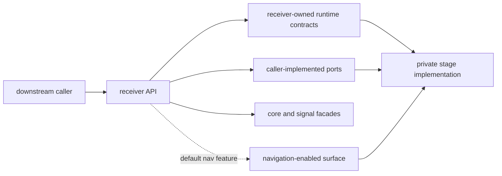
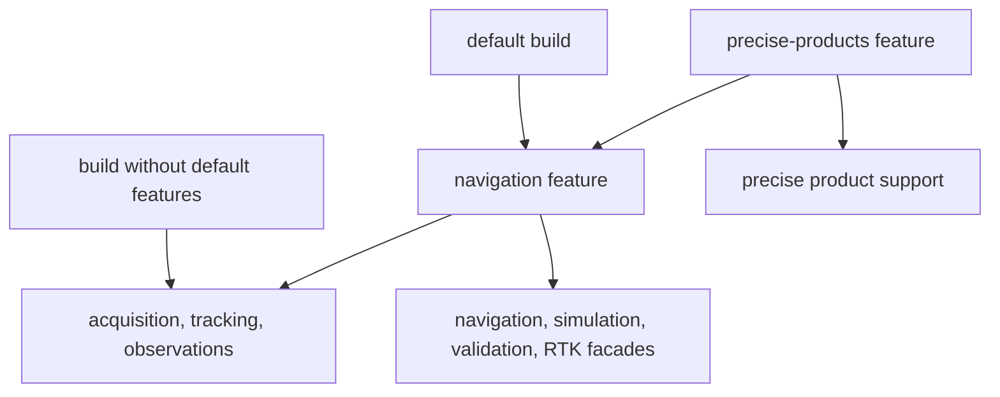

# API Surface

Downstream code enters the crate through `bijux_gnss_receiver::api`. All stage,
engine, port, simulation, and validation modules remain private, so a public
item's re-export through `api` is the deliberate compatibility decision.

## Surface By Responsibility

| family | representative contracts | compatibility concern |
| --- | --- | --- |
| configuration and runtime | `ReceiverConfig`, `ReceiverPipelineConfig`, `ReceiverRuntime`, `ReceiverError` | validation and default changes alter execution even when signatures remain stable |
| top-level execution | `Receiver`, `ReceiverEngine`, `RunArtifacts` | callers depend on stage ordering, returned evidence, and empty-input behavior |
| stage entrypoints | acquisition and tracking engines, tracking sessions, observation builders | these are public operational seams, not permission to import private helpers |
| effect ports | signal/sample sources, clock, artifact sink, logger, trace, and metric sinks | implementors depend on trait methods and error behavior |
| artifacts and validation | channel reports, residuals, quality reports, reference comparison, validation reports | field meaning and refusal evidence matter as much as Rust type compatibility |
| lower-owner facades | `core`, `signal`, and navigation APIs | convenience does not move semantic ownership into receiver |

The authoritative export list is the
[public API module](../../../crates/bijux-gnss-receiver/src/api.rs). The
[crate API contract](../../../crates/bijux-gnss-receiver/API.md) provides the
compact public entrypoint, while the
[public API guide](../../../crates/bijux-gnss-receiver/docs/PUBLIC_API.md)
groups exports by caller purpose.

## Feature Shape Is API Shape

Navigation is enabled by default. Disabling default features removes navigation
entrypoints, simulation exports, reference-validation helpers, validation
reports, and the large navigation/RTK facade from the public surface. The
`precise-products` feature enables navigation as a prerequisite.

Public examples and compatibility reviews must name their feature set. An
example that compiles only with defaults is not proof that the base receiver API
works without navigation.

## Decide Whether An Export Belongs

Add a receiver-owned export only when a caller needs one of these:

- configuration that controls receiver execution;
- an entrypoint for acquisition, tracking, observation construction, or
  receiver-side navigation handoff;
- typed runtime evidence returned by those operations;
- a port that lets a caller provide input, time, telemetry, or artifact output;
- receiver-side validation that combines stage evidence.

Do not export a private helper merely to make a test or one caller convenient.
Do not re-export lower-layer science to avoid a proper dependency when the
caller actually owns that dependency. If a core, signal, or navigation contract
changes, update its owner first and treat the receiver facade as a downstream
compatibility review.

## Compatibility Review

For every public change, inspect more than the signature:

1. Determine whether defaults, feature availability, units, refusal behavior,
   or returned evidence changed.
2. Check direct callers through the
   [public import guide](public-imports.md).
3. Add a compile-time or integration assertion that uses the public route, not
   a private module.
4. Update the [compatibility commitments](compatibility-commitments.md) when a
   caller-visible guarantee changes.
5. Route persistence changes to the
   [artifact contract](artifact-contracts.md) rather than attaching repository
   semantics to an in-memory type.

The surface is broad today. “Curated” means every re-export is accountable; it
does not mean every exported family is equally stable or receiver-owned.
