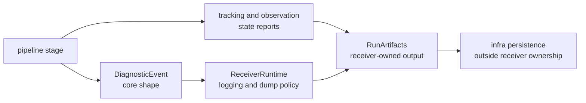

# Diagnostic Contracts

Receiver diagnostics are not log decoration. They are the reader-facing trail
from a stage decision to a runtime artifact or operator-visible failure. A
diagnostic change is a contract change when it changes severity, reason text,
stage attribution, channel state, or whether the event is preserved in a run
artifact.

## Diagnostic Flow

The receiver owns the runtime meaning in this flow. `bijux-gnss-core` owns
shared diagnostic record shape, and `bijux-gnss-infra` owns persisted
repository layout after receiver execution finishes.

## Diagnostic Guarantees

- pipeline stages emit stable diagnostic meaning rather than ad hoc log prose
- severity remains explicit and maps to the real consequence of the event
- stage and channel context survive long enough for artifacts and tests to
  explain what happened
- receiver workflows may summarize diagnostics by run because runtime
  execution owns the operational context
- diagnostics do not become a hidden configuration channel or a substitute for
  typed runtime state

## Review The Exact Contract

| changed surface | contract question | proof anchor |
| --- | --- | --- |
| `DiagnosticEvent` emission | Does the severity and message identify a receiver-stage condition? | `crates/bijux-gnss-receiver/src/pipeline/` and `crates/bijux-gnss-receiver/src/engine/logging.rs` |
| diagnostics dump behavior | Does the dump preserve enough run context without inventing persistence policy? | `crates/bijux-gnss-receiver/src/engine/diagnostics.rs` |
| tracking channel state | Can a reader explain lock, degraded, reacquired, lost, or cycle-slip state from emitted data? | `crates/bijux-gnss-receiver/tests/integration_tracking_channel_state_reports.rs` |
| observation diagnostic propagation | Does observation metadata preserve the tracking reason it depends on? | `crates/bijux-gnss-receiver/tests/integration_observations_lock_states.rs` |
| run artifact summary | Does `RunArtifacts` expose receiver output without naming repository files? | `crates/bijux-gnss-receiver/docs/ARTIFACTS.md` |

## Reader Contract

When a receiver run fails or degrades, a reader should be able to answer three
questions without reading private helper code:

- which stage observed the condition
- whether the condition is fatal, degraded, informational, or recoverable
- which artifact or state report carries the evidence

If the answer requires guessing from log prose, the diagnostic contract is not
strong enough.
