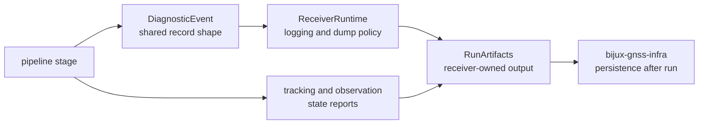

# Diagnostic Contracts

Receiver diagnostics are contract evidence. They connect a stage decision to
operator-visible output, test assertions, and receiver-owned artifacts. A
diagnostic change is material when it changes severity, reason text, stage
attribution, channel state, ordering, or artifact retention.

## Diagnostic Flow

`bijux-gnss-core` owns the shared diagnostic record shape. The receiver owns the
runtime meaning, ordering, and stage attribution. Infrastructure owns persisted
repository layout after receiver execution finishes.

## Severity Meaning

| severity meaning | reader expectation | receiver obligation |
| --- | --- | --- |
| informational | useful run context with no degraded decision | keep the stage and channel context clear |
| recoverable | the stage corrected or retried a bounded condition | preserve the recovery reason and final state |
| degraded | the run continued with weaker evidence or lower confidence | expose the degraded reason in artifacts or state reports |
| fatal | the stage refused to continue safely | emit enough context for the command layer to report the failure |

## Contract Review

| changed surface | contract question | proof anchor |
| --- | --- | --- |
| diagnostic event emission | Does severity match the real receiver consequence? | the [pipeline source](../../../crates/bijux-gnss-receiver/src/pipeline/) |
| runtime dump behavior | Does the dump preserve run context without claiming persistence ownership? | the [diagnostic runtime source](../../../crates/bijux-gnss-receiver/src/engine/diagnostics.rs) |
| acquisition report fields | Can a reader explain selected, ambiguous, rejected, or refined candidates? | acquisition explainability and ambiguity tests |
| tracking channel state | Can a reader explain lock, degraded, reacquired, lost, or slip state? | tracking channel-state and continuity tests |
| observation propagation | Does observation metadata keep the tracking reason it depends on? | observation lock-state and artifact tests |
| artifact summary | Does `RunArtifacts` expose receiver evidence before infra stores it? | the receiver [artifact guide](../../../crates/bijux-gnss-receiver/docs/ARTIFACTS.md) |

## Reader-Facing Standard

When a receiver run fails, degrades, or recovers, the emitted evidence should
answer these questions without private helper archaeology:

- Which stage observed the condition?
- Which satellite, signal, channel, or epoch was affected?
- Was the condition informational, recoverable, degraded, or fatal?
- Which state report, diagnostic dump, or receiver artifact carries the proof?
- Which lower crate owns any non-receiver fact needed to interpret it?

## Anti-Patterns

- Logging prose that is not mirrored by typed evidence.
- A diagnostic reason that repeats the symptom but not the stage consequence.
- A degraded state that disappears before artifacts or observation metadata can
  explain it.
- Persistence naming in receiver diagnostics; persisted layout belongs to infra.

## First Proof Check

Start with the receiver [diagnostic runtime source](../../../crates/bijux-gnss-receiver/src/engine/diagnostics.rs),
[engine source](../../../crates/bijux-gnss-receiver/src/engine/engine.rs), and
[pipeline source](../../../crates/bijux-gnss-receiver/src/pipeline/). Then inspect
the closest integration test for the affected acquisition, tracking,
observation, or artifact surface.
