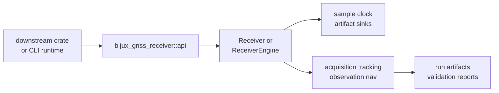

# Entrypoints and Examples

Use this page to choose the receiver starting point before opening the runtime
source. Receiver entrypoints are about turning samples, configuration, and
ports into acquisition, tracking, observation, navigation, and artifact
evidence.

## Entry Route



## Starting Points

| reader need | start here | then inspect |
| --- | --- | --- |
| launch a receiver run | runtime contracts | `Receiver`, `ReceiverEngine`, and runtime config |
| connect samples or clocks | port contracts | sample-source, clock, trace, and sink interfaces |
| understand stage behavior | stage contracts | acquisition, tracking, observation, or nav helpers |
| explain produced artifacts | artifact contracts | run artifacts and stage evidence records |
| compare against truth | validation and simulation contracts | reference validation, simulation fixtures, and reports |
| use receiver from Rust | public import docs | `bijux_gnss_receiver::api` and lower-owner re-exports |

## Minimal Examples

Runtime-facing code should enter through the public API:

```rust
use bijux_gnss_receiver::api::{Receiver, ReceiverConfig};

let _config = ReceiverConfig::default();
let _ = std::any::type_name::<Receiver>();
```

Stage-specific code should use the owning stage surface instead of rebuilding
the runtime around private modules.

## First Proof Check

Inspect `crates/bijux-gnss-receiver/src/api.rs`,
`crates/bijux-gnss-receiver/docs/PUBLIC_API.md`,
`crates/bijux-gnss-receiver/docs/RUNTIME.md`,
`crates/bijux-gnss-receiver/docs/PORTS.md`, and
`crates/bijux-gnss-receiver/docs/REFERENCE_VALIDATION.md` to confirm these
reader routes still match real public runtime entrypoints.
