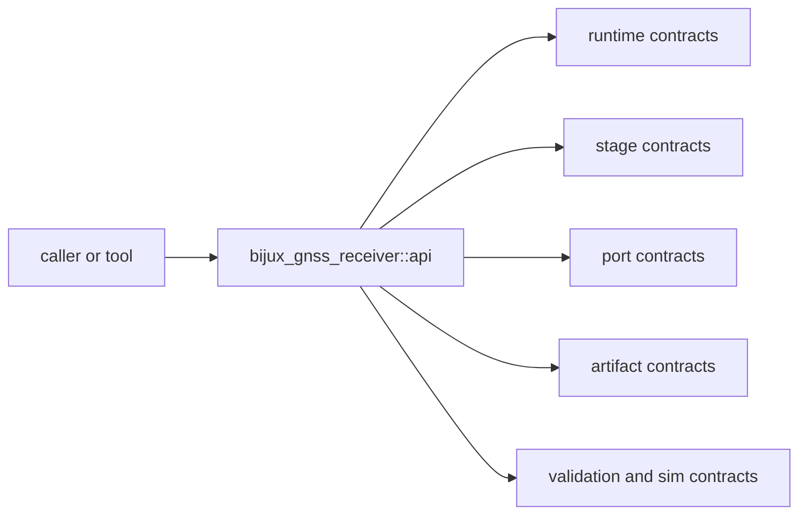

# Interfaces

Open this section when the question is contractual: which runtime, stage, port,
artifact, validation, and simulation surfaces are safe for another crate or
tool to rely on.

## Contract Surface

## Read These First

- open [Foundation](../foundation/) first if the question is whether a public
  surface belongs in receiver at all
- stay in this section when the question is whether an export, trait, or
  runtime record deserves a durable public promise

## First Proof Check

- `crates/bijux-gnss-receiver/src/api.rs`
- `crates/bijux-gnss-receiver/API.md`
- `crates/bijux-gnss-receiver/docs/PUBLIC_API.md`
