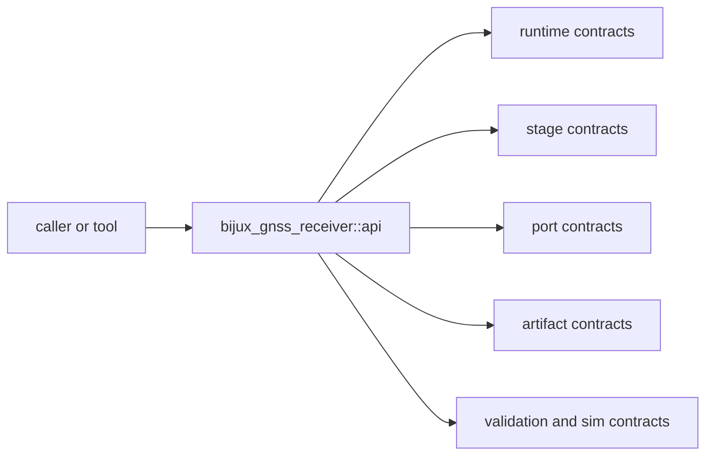

# Interfaces

Open this section when the question is contractual: which runtime, stage, port,
artifact, validation, and simulation surfaces are safe for another crate or
tool to rely on.

## Contract Surface

## Read These First

- open [API Surface](api-surface.md) first when the question is whether a type
  or helper should be part of the durable receiver boundary
- open [Runtime Contracts](runtime-contracts.md) when the issue starts from
  configuration, runtime sinks, or top-level receiver types
- open [Port Contracts](port-contracts.md) when the issue is about samples,
  clocks, or artifact sinks

## Pages In This Section

- [API Surface](api-surface.md)
- [Public Imports](public-imports.md)
- [Runtime Contracts](runtime-contracts.md)
- [Diagnostic Contracts](diagnostic-contracts.md)
- [Stage Contracts](stage-contracts.md)
- [Port Contracts](port-contracts.md)
- [Artifact Contracts](artifact-contracts.md)
- [Validation And Simulation Contracts](validation-and-simulation-contracts.md)
- [Entrypoints And Examples](entrypoints-and-examples.md)
- [Compatibility Commitments](compatibility-commitments.md)

## First Proof Check

- `crates/bijux-gnss-receiver/src/api.rs`
- `crates/bijux-gnss-receiver/API.md`
- `crates/bijux-gnss-receiver/docs/PUBLIC_API.md`

## Leave This Section When

- leave for [Foundation](../foundation/) when the question is whether a public
  surface belongs in receiver at all
- leave for [Architecture](../architecture/) when the contract issue reveals
  structural drift underneath it
- leave for [Operations](../operations/) or [Quality](../quality/) when the
  public shape is clear and the question becomes safe change or proof
