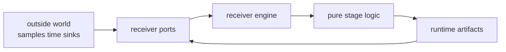

# Port Contracts

Ports are the receiver runtime seams for samples, clocks, and artifact sinks.
They let the engine touch external inputs and outputs without letting stage
logic read files, inspect environment, choose command flags, or define
repository persistence policy.

## Port Flow

## Owned Port Surfaces

| surface | purpose | ownership limit |
| --- | --- | --- |
| `SampleSource` | feed samples into receiver execution | no dataset registry or command discovery logic |
| `FileSamples` | adapt file-backed samples into the runtime seam | no persisted run-layout policy |
| `MemorySamples` | support deterministic in-memory runs and tests | no synthetic truth ownership |
| `ArtifactSink` | receive runtime artifacts during execution | no infra artifact indexing or manifest policy |
| `Clock` and `SystemClock` | isolate time access from pure stage logic | no command scheduling or report semantics |
| `SampleSourceError` | report runtime input failure at the port boundary | no broad repository failure taxonomy |

## Review Questions

- Does the port carry runtime input, output, or time access?
- Does the proposed field force repository naming, command UX, or manifest
  layout into receiver code?
- Can stage logic remain testable without filesystem, environment, or wall-clock
  access?
- Does infra still own persisted evidence after the receiver emits artifacts?

## First Proof Check

Inspect `crates/bijux-gnss-receiver/docs/PORTS.md`,
`crates/bijux-gnss-receiver/src/ports/`,
`crates/bijux-gnss-receiver/src/io/data.rs`, and the nearest port, file sample,
runtime, or artifact-sink integration test.
