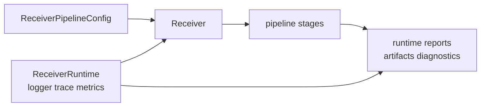

# Runtime Contracts

The receiver runtime contract defines how external effects enter and leave a
receiver run. It is the seam between pure stage logic and the world around the
run: clocks, sample sources, diagnostics, traces, metrics, and artifact sinks.

## Contract Surfaces

| surface | caller can rely on | proof |
| --- | --- | --- |
| `ReceiverConfig` and `ReceiverPipelineConfig` | runtime behavior is configured through receiver-owned types | `crates/bijux-gnss-receiver/src/engine/receiver_config.rs` |
| `ReceiverRuntimeConfig` | run id, trace directory, run directory, diagnostics dump, and capture start time are runtime concerns | `crates/bijux-gnss-receiver/src/engine/runtime.rs` |
| `Logger`, `TraceSink`, `MetricsSink` | effects are injected through explicit traits, not hidden globals | `crates/bijux-gnss-receiver/src/engine/runtime.rs` |
| `Receiver` | configuration and runtime sinks are composed into one receiver boundary | `crates/bijux-gnss-receiver/src/engine/receiver.rs` |
| support matrix | runtime reports can describe supported constellation and signal behavior | `crates/bijux-gnss-receiver/src/engine/support_matrix.rs` |

## Effect Boundary

## Stability Expectations

- New runtime controls should be explicit fields, typed configuration, or
  effect traits; hidden process state is the wrong boundary.
- Runtime contracts should not absorb command-only policy such as report
  formatting or CLI defaults.
- Runtime contracts should not absorb repository persistence policy such as
  directory naming, manifest identity, or artifact indexing.
- Stage internals can evolve, but public runtime evidence must keep enough
  context for operators and tests to understand degraded or rejected outcomes.

## Review Questions

- Does the change alter how a receiver is configured or launched?
- Does it add or remove a runtime effect such as logging, tracing, metrics, or
  capture-time context?
- Does it change how support inventory or diagnostics are exposed?
- Does a command or infrastructure caller now depend on a receiver internal
  module instead of a runtime contract?

## First Proof Check

Inspect `crates/bijux-gnss-receiver/docs/RUNTIME.md`,
`crates/bijux-gnss-receiver/src/engine/runtime.rs`,
`crates/bijux-gnss-receiver/src/engine/receiver.rs`,
`crates/bijux-gnss-receiver/src/engine/receiver_config.rs`, and
`crates/bijux-gnss-receiver/tests/integration_receiver_support_matrix_inventory.rs`.
