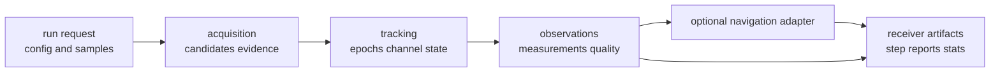

# Stage Contracts

Stage contracts describe how receiver runtime work moves from acquisition into
tracking, observations, and optional navigation adapters. They are contracts
because their outputs become diagnostics, artifacts, validation evidence, and
operator reports through higher layers.

## Stage Handoff Flow

## Owned Stage Families

| stage | owner paths | contract evidence |
| --- | --- | --- |
| acquisition | `src/pipeline/acquisition/`, `acquisition_assistance.rs` | candidates, ambiguity, refinement, explainability, false-alarm evidence |
| tracking | `src/pipeline/tracking/` | epochs, lock state, channel lifecycle, reacquisition, carrier and code evidence |
| observations | `src/pipeline/observations/` | measurement quality, residuals, rejection status, observation artifacts |
| navigation adapters | `src/pipeline/navigation.rs`, `src/pipeline/navigation_filter.rs` | receiver-owned handoff into nav science when enabled |
| reports | `StepReport`, `StepStats`, receiver artifacts | stage timing, counts, diagnostics, and evidence summaries |

## Boundary Decisions

- Keep stage ordering, handoff, state transitions, and runtime diagnostics here.
- Leave spreading codes, replicas, and reusable DSP primitives in signal.
- Leave orbit, correction, PPP, RTK, and estimator science in nav.
- Leave manifests, persisted directories, and artifact indexing in infra.
- Leave command syntax and report routing in `bijux-gnss`.

## First Proof Check

Inspect `crates/bijux-gnss-receiver/docs/PIPELINE.md`,
`crates/bijux-gnss-receiver/src/pipeline/`, and the closest
`crates/bijux-gnss-receiver/tests/integration_acquisition_*.rs`,
`integration_tracking_*.rs`, `integration_observations_*.rs`, or
`integration_navigation_*.rs` test family for the changed stage.
