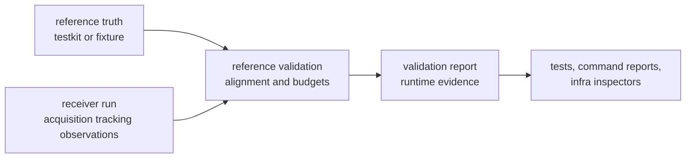

# Validation And Simulation Contracts

Receiver validation and simulation prove receiver-boundary behavior. They
compare runtime outputs to reference truth, exercise synthetic receiver flows,
and package validation reports that explain runtime decisions. They do not own
repository artifact layout or the original truth sources.

## Proof Flow

## Contract Families

| family | receiver-owned surface | reader promise |
| --- | --- | --- |
| reference alignment | `src/reference_validation.rs` | receiver outputs can be compared to reference epochs without repository policy |
| validation reports | `src/validation_report.rs` and `src/validation_report/` | runtime decisions, budgets, and integrity classifications stay typed |
| validation helpers | `src/validation_helpers.rs` and related report builders | receiver evidence can be summarized without hiding stage meaning |
| synthetic execution | `src/sim/synthetic/` | synthetic scenarios exercise acquisition, tracking, observations, and artifacts through the receiver boundary |
| covariance realism | `src/covariance_realism.rs` when navigation support is enabled | covariance claims remain tied to receiver-produced evidence |

## Boundary Decisions

- Truth fixtures may come from `bijux-gnss-testkit`, but receiver validation
  owns how runtime outputs are aligned and judged.
- Persisted artifact layout and repository inspection belong to infra after
  receiver artifacts exist.
- Signal and navigation crates own their scientific primitives; receiver
  simulation owns the runtime scenario that combines them.
- A validation report is a receiver contract when it explains runtime behavior,
  not merely because a test happens to use it.

## First Proof Check

Inspect `crates/bijux-gnss-receiver/docs/REFERENCE_VALIDATION.md`,
`crates/bijux-gnss-receiver/docs/SIMULATION.md`,
`crates/bijux-gnss-receiver/docs/TESTS.md`,
`crates/bijux-gnss-receiver/src/reference_validation.rs`,
`crates/bijux-gnss-receiver/src/validation_report.rs`,
`crates/bijux-gnss-receiver/src/sim/synthetic/`,
`crates/bijux-gnss-receiver/tests/integration_navigation_validation_run.rs`,
and `crates/bijux-gnss-receiver/tests/integration_synthetic.rs`.
