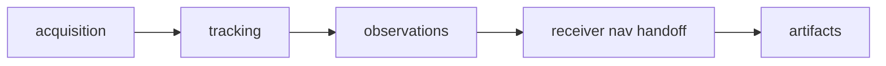

# Common Workflows

Use this page to choose the first proof path for recurring receiver edits. Each
workflow starts from the runtime contract that changed, then widens only when
the result crosses into lower-owner meaning or public operator behavior.

## Add Or Change Runtime Configuration

- Read `crates/bijux-gnss-receiver/docs/RUNTIME.md`.
- Confirm the field belongs to runtime composition rather than command policy.
- Update receiver-facing docs if field meaning, defaults, or validation moves.
- Run the smallest config or engine test that proves accepted and rejected
  behavior.
- Inspect `api.rs` only when the field is public.

## Change One Stage Family

- Identify whether the change is local to acquisition, tracking, observations,
  or receiver-owned navigation handoff.
- Run the most local stage test first.
- Run the narrowest integration test that proves the runtime-visible handoff.
- Add signal or nav proof only when the stage changes lower-owned meaning.

## Change Ports Or Runtime Sinks

- Read `crates/bijux-gnss-receiver/docs/PORTS.md`.
- Confirm the change is execution-oriented, not repository layout policy.
- Check both the public port contract and the concrete adapter.
- Run tests that exercise the affected source, sink, clock, or timing seam.

## Change Validation Or Synthetic Proof

- Read `REFERENCE_VALIDATION.md` and `SIMULATION.md`.
- State whether runtime behavior changed or the proof expectation changed.
- Run the relevant validation-report or synthetic test family.
- Do not broaden tolerances unless the document names the physical or runtime
  reason and the proof still defends it.

## Change Artifacts Or Diagnostics

- Read `ARTIFACTS.md` before changing `RunArtifacts` or emitted stage reports.
- Read diagnostic contracts before changing severity, reason, or state
  propagation.
- Confirm infra persistence did not move into receiver.
- Run artifact, state-report, or diagnostic integration proof before broader
  workflow checks.

The common failure is validating too late and too broadly. A useful receiver
workflow names the runtime seam first and uses broader tests only to confirm
that the seam still composes with neighbors.
