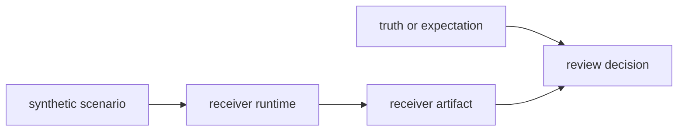

# Fixture And Simulation Care

`bijux-gnss-receiver` relies on fixture-backed and synthetic proofs that carry
runtime meaning, not only test convenience.

## Evidence Flow

## Care Rules

- treat truth-table, golden, and synthetic validation outputs as runtime proof
- when changing a fixture-backed behavior, explain whether the runtime or the
  expectation was wrong
- avoid silently broadening tolerances to make a runtime proof green
- keep synthetic helpers tied to the receiver boundary rather than letting them
  become a generic truth warehouse

## Scenario Ledger

| scenario kind | receiver proof | wrong use |
| --- | --- | --- |
| clean synthetic capture | lock, phase, and observation continuity | proving external product parsing |
| fade or interruption | degraded state, reacquisition, and continuity evidence | hiding unstable channel behavior |
| nav-bit transition | carrier and code behavior across data sign changes | replacing signal truth models |
| low C/N0 case | refusal, uncertainty, and degraded-state behavior | lowering quality thresholds silently |

## Why This Matters

This crate proves many claims through synthetic and integration evidence. Loose
fixture hygiene can make the suite look broad while weakening what it proves.

## First Proof Check

- `crates/bijux-gnss-receiver/docs/SIMULATION.md`
- `crates/bijux-gnss-receiver/tests/integration_synthetic.rs`
- `crates/bijux-gnss-receiver/tests/integration_navigation_validation_run.rs`

## Review Checks

- Does the fixture explain the behavior it proves before naming the file?
- Does the expected evidence cover state transitions, not only final success?
- Is independent truth still owned by testkit or a domain crate when needed?
