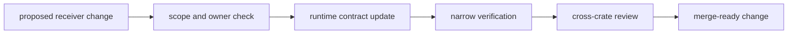

# Operations

Open this section when the question is how to change `bijux-gnss-receiver`
without quietly moving runtime meaning, widening public contracts carelessly,
or breaking the stage proof surface.

## Operational Model

## Read These First

- open [Change Sequence](change-sequence.md) first when the work touches
  runtime config, stage behavior, ports, or validation helpers
- open [Verification Commands](verification-commands.md) when you need the
  narrowest executable proof for a local receiver change
- open [Review Scope](review-scope.md) when a change seems to affect more than
  one runtime family at once

## Pages In This Section

- [Common Workflows](common-workflows.md)
- [Local Development](local-development.md)
- [Change Sequence](change-sequence.md)
- [Verification Commands](verification-commands.md)
- [Fixture And Simulation Care](fixture-and-simulation-care.md)
- [Review Scope](review-scope.md)
- [Release And Versioning](release-and-versioning.md)

## First Proof Check

- `crates/bijux-gnss-receiver/README.md`
- `crates/bijux-gnss-receiver/docs/TESTS.md`
- `crates/bijux-gnss-receiver/tests/`

## Leave This Section When

- leave for [Interfaces](../interfaces/) when the question is what the
  receiver promises rather than how to change it safely
- leave for [Quality](../quality/) when the operational sequence is clear and
  the next question is proof sufficiency
