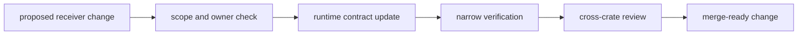

# Operations

Open this section when the question is how to change `bijux-gnss-receiver`
without quietly moving runtime meaning, widening public contracts carelessly,
or breaking the stage proof surface.

## Operational Model

## Read These First

- open [Foundation](../foundation/) first if the change may belong in another
  crate
- stay in this section when the ownership is clear and the real question is
  how to edit the runtime safely

## First Proof Check

- `crates/bijux-gnss-receiver/README.md`
- `crates/bijux-gnss-receiver/docs/TESTS.md`
- `crates/bijux-gnss-receiver/tests/`
