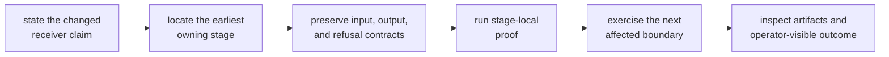
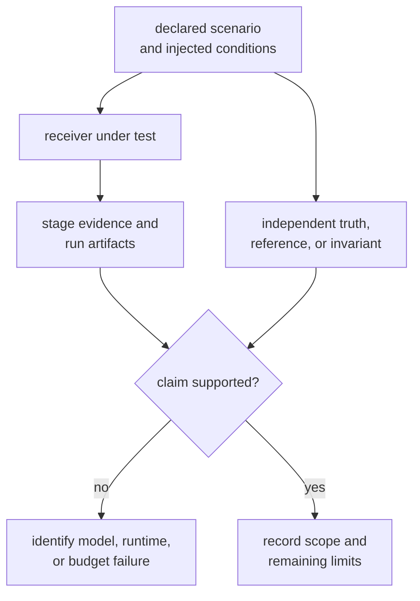

# Operating the Receiver

Receiver changes are safest when they begin at the earliest stage whose meaning
changes. Start there, preserve the evidence passed to the next stage, and only
then inspect the final run result. A position solution can look plausible while
acquisition ambiguity, tracking continuity, or observation quality has already
regressed.

## Find the Owning Surface

| Change | Start with | Evidence that must survive |
| --- | --- | --- |
| Configuration, defaults, clocks, sinks, or injected effects | [Runtime contracts](../interfaces/runtime-contracts.md) and [port contracts](../interfaces/port-contracts.md) | validated configuration, explicit defaults, and controlled side effects |
| Candidate search, ranking, ambiguity, or assistance | [Acquisition stage contract](../interfaces/stage-contracts.md) | accepted hypothesis, uncertainty, diagnostics, and refusal |
| Code or carrier loops, lock state, fades, or reacquisition | [Tracking stage contract](../interfaces/stage-contracts.md) | ordered epochs, channel transitions, continuity, and uncertainty |
| Measurement construction or quality decisions | [Observation stage contract](../interfaces/stage-contracts.md) | typed epochs, exclusions, residuals, and measurement quality |
| Navigation invocation from receiver output | [Navigation handoff contract](../interfaces/stage-contracts.md) | explicit handoff, feature behavior, validation, and refusal |
| Reports, diagnostics, or receiver-owned run products | [Artifact contracts](../interfaces/artifact-contracts.md) | typed evidence and stable interpretation before persistence |
| Synthetic scenarios or truth comparisons | [Fixture and simulation care](fixture-and-simulation-care.md) | independent expectation, scenario identity, units, and coverage |
| Throughput, latency, or allocation cost | [Receiver performance evidence](performance-and-profiling.md) | comparable measurements plus unchanged scientific proof |

If the change does not alter receiver execution, stage handoff, or
receiver-owned evidence, confirm the owner before editing. Signal definitions,
navigation science, persisted repository layout, and command presentation have
different owners.

## Change from the Inside Out

Use the [change sequence](change-sequence.md) for runtime configuration, stage,
port, and validation work. The [receiver extension guide](receiver-extension-guide.md)
helps decide whether a new capability belongs in this crate at all. Before
committing, use the [verification guide](verification-commands.md) to choose
the narrowest command that proves the changed contract rather than the largest
command available.

## Keep Truth Independent

Synthetic generation and expected results must not become two expressions of
the same implementation. When a scenario or fixture changes, state whether the
model, receiver, threshold, or expected output was wrong. Regenerating an
expectation from changed receiver output cannot establish correctness.

The [simulation guide](../../../crates/bijux-gnss-receiver/docs/SIMULATION.md)
defines what the receiver simulation surface owns. Use the
[quality guide](../quality/) to decide whether the available evidence is
sufficient for the claim.

## Review the Real Blast Radius

A receiver change crosses a boundary when it changes any of these:

- the meaning or ordering of stage output
- a lock, degraded, refused, or recovered state
- uncertainty, units, tolerances, or validation budgets
- optional navigation behavior or feature-gated output
- receiver artifact fields or diagnostic interpretation
- deterministic replay or externally controlled effects

Use [review scope](review-scope.md) when more than one family is affected.
Release-facing compatibility and version decisions belong in
[release and versioning](release-and-versioning.md).

Commit when one receiver claim is implemented, its owning-stage proof passes,
the first affected handoff is exercised, and any remaining evidence limit is
written plainly. Do not combine unrelated acquisition, tracking, observation,
and artifact changes merely because they share a full receiver run.
