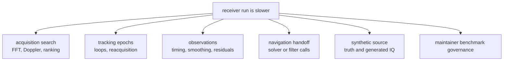

# Performance And Profiling

Profile the receiver when runtime cost changes at a staged execution boundary:
sample ingestion, acquisition search, tracking epochs, observation building,
navigation handoff, synthetic execution, or receiver-side validation.

Do not use this page for repository benchmark governance. Once the question is
baseline policy, published benchmark evidence, or maintainer workflow output,
route to the [Maintainer handbook](../../07-bijux-gnss-dev/).

## Triage Map

## Where To Look

| symptom | inspect first | likely proof |
| --- | --- | --- |
| acquisition runtime grew | `src/pipeline/acquisition/`, signal model selection, search windows, candidate ranking | acquisition integration tests and focused profiling output |
| tracking runtime grew | `src/pipeline/tracking/`, loop updates, reacquisition, fade handling, channel artifacts | tracking integration tests around lock, reacquisition, noise, and loop bandwidth |
| observation runtime grew | `src/pipeline/observations/`, pseudorange timing, smoothing, residual reports | observation accuracy and validation tests |
| synthetic validation grew | `src/sim/synthetic/`, truth generation, stage accuracy helpers | synthetic integration tests and generated run artifacts |
| navigation-enabled receiver runtime grew | `src/pipeline/navigation.rs`, `src/pipeline/navigation_filter.rs` | receiver navigation tests plus `bijux-gnss-nav` solver tests when science changed |
| benchmark report changed | maintainer benchmark command and output contracts | `crates/bijux-gnss-dev/docs/BENCHMARKS.md` |

## Profiling Rules

- Profile the stage that changed before running broad comparisons.
- Keep profiles tied to a repeatable capture, synthetic scenario, config, or
  artifact bundle.
- Preserve degraded-state and diagnostic output while optimizing; performance
  work must not erase evidence.
- Separate runtime optimization from signal or navigation algorithm changes
  unless the cost and behavior move together.

## First Proof Check

Start with `crates/bijux-gnss-receiver/docs/PIPELINE.md`,
`crates/bijux-gnss-receiver/docs/RUNTIME.md`, and the affected stage module.
If the profiling result will be used as repository evidence, also inspect
`crates/bijux-gnss-dev/docs/BENCHMARKS.md` and
`crates/bijux-gnss-dev/docs/OUTPUTS.md`.
